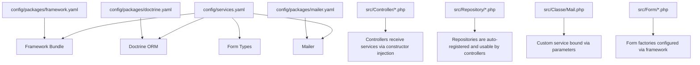
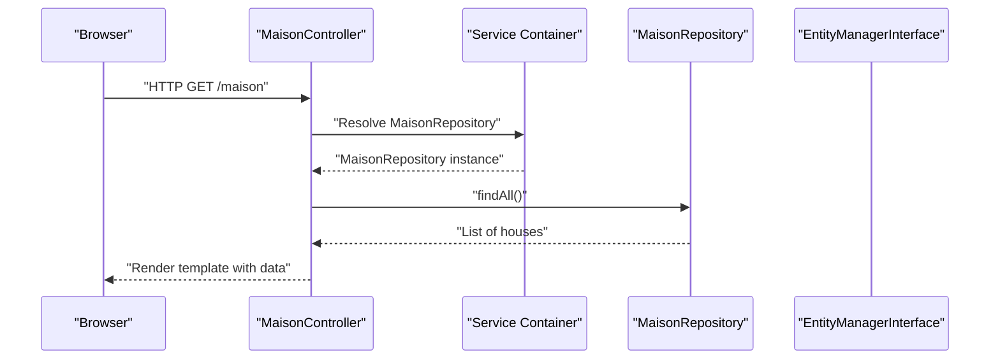
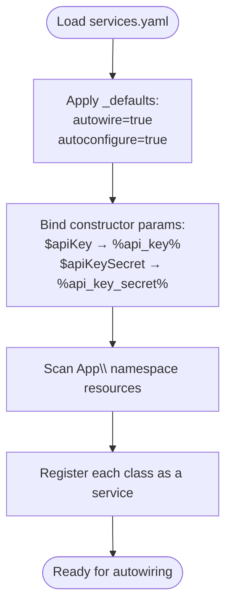
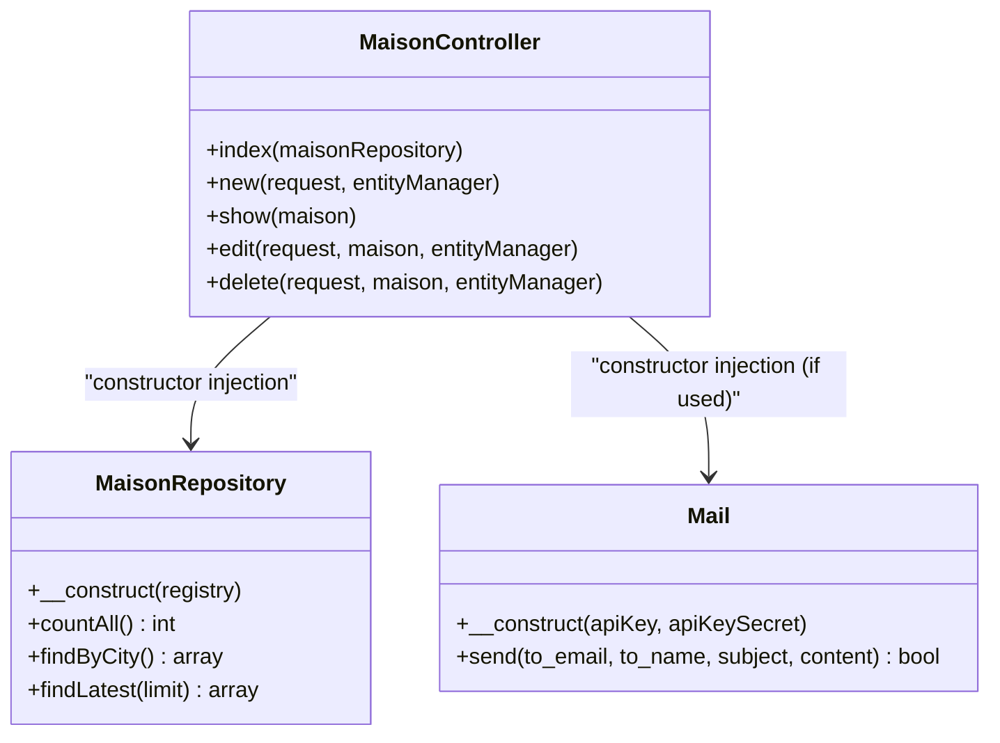
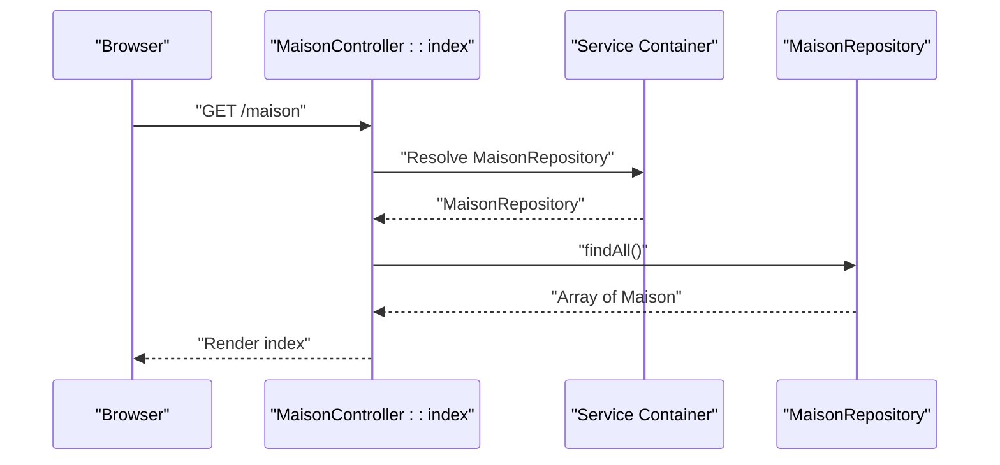
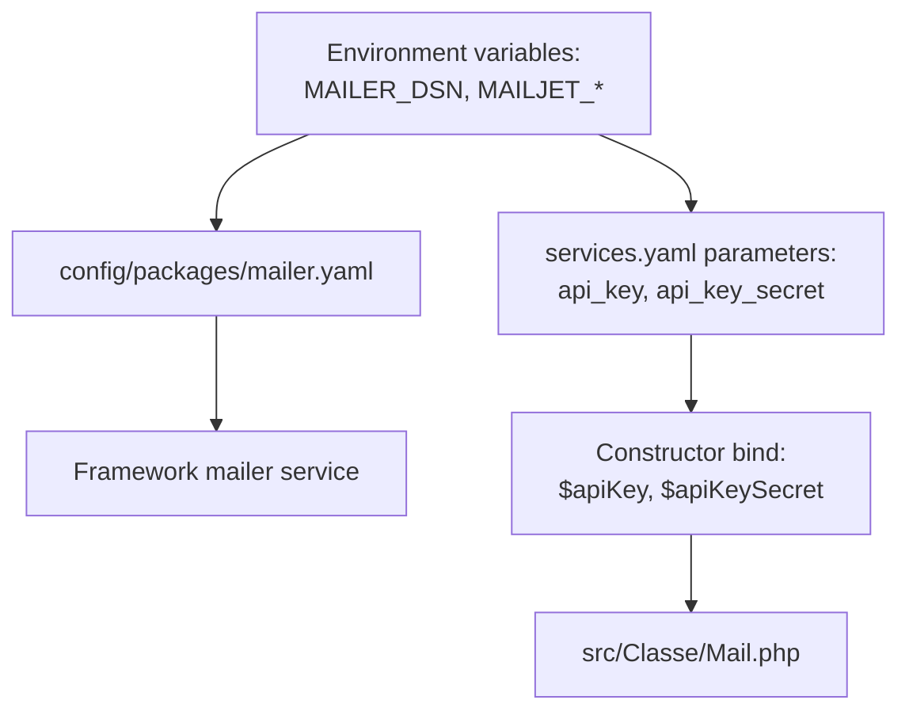
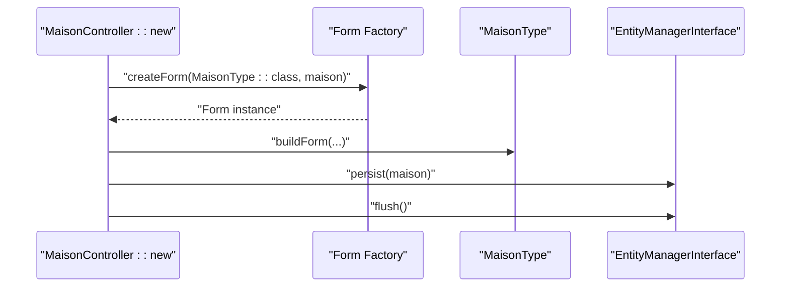
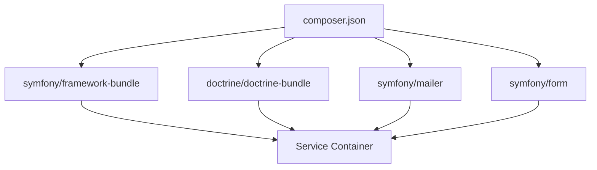

# Dependency Injection and Services

<cite>
**Referenced Files in This Document**
- [services.yaml](file://config/services.yaml)
- [framework.yaml](file://config/packages/framework.yaml)
- [doctrine.yaml](file://config/packages/doctrine.yaml)
- [mailer.yaml](file://config/packages/mailer.yaml)
- [composer.json](file://composer.json)
- [MaisonController.php](file://src/Controller/MaisonController.php)
- [MaisonRepository.php](file://src/Repository/MaisonRepository.php)
- [Mail.php](file://src/Classe/Mail.php)
- [MaisonType.php](file://src/Form/MaisonType.php)
- [Kernel.php](file://src/Kernel.php)
- [reference.php](file://config/reference.php)
</cite>

## Table of Contents
1. [Introduction](#introduction)
2. [Project Structure](#project-structure)
3. [Core Components](#core-components)
4. [Architecture Overview](#architecture-overview)
5. [Detailed Component Analysis](#detailed-component-analysis)
6. [Dependency Analysis](#dependency-analysis)
7. [Performance Considerations](#performance-considerations)
8. [Troubleshooting Guide](#troubleshooting-guide)
9. [Conclusion](#conclusion)
10. [Appendices](#appendices)

## Introduction
This document explains how Symfony’s dependency injection (DI) container and service configuration work in this project. It covers service registration, autowiring, automatic service configuration, constructor injection, service tagging, built-in services, custom service creation, and service decoration. Practical examples demonstrate injecting repositories into controllers, configuring mail services, and setting up form factories. It also addresses service lifecycle, scope management, performance considerations, and best practices.

## Project Structure
The DI configuration is primarily centralized in a single YAML file and complemented by framework and bundle configuration files. The application leverages autowiring and autoconfiguration to minimize boilerplate while keeping services discoverable and injectable automatically.

**Diagram sources**
- [services.yaml:13-29](file://config/services.yaml#L13-L29)
- [framework.yaml:1-16](file://config/packages/framework.yaml#L1-L16)
- [doctrine.yaml:1-55](file://config/packages/doctrine.yaml#L1-L55)
- [mailer.yaml:1-4](file://config/packages/mailer.yaml#L1-L4)

**Section sources**
- [services.yaml:1-29](file://config/services.yaml#L1-L29)
- [framework.yaml:1-16](file://config/packages/framework.yaml#L1-L16)
- [doctrine.yaml:1-55](file://config/packages/doctrine.yaml#L1-L55)
- [mailer.yaml:1-4](file://config/packages/mailer.yaml#L1-L4)

## Core Components
- Service registration and defaults
  - The container scans the src/ namespace and registers each class as a service by its fully qualified class name. Autowiring and autoconfiguration are enabled globally for services in this file, reducing manual wiring.
  - Automatic bindings are applied for constructor parameters named $apiKey and $apiKeySecret, sourcing values from parameters defined in the same file.

- Built-in Symfony services
  - Controllers extend a framework-provided base class that integrates with the container and provides helpers. Doctrine’s EntityManagerInterface and repositories are available automatically due to autowiring.
  - The framework configuration enables sessions and test-specific overrides.

- Custom services
  - A custom mail service is defined as a PHP class under src/. It receives API credentials via constructor injection, which are bound from parameters in services.yaml.

- Form factories
  - Form types are standard Symfony classes. They are auto-registered and used by controllers to build forms. The framework handles form factory resolution and configuration.

**Section sources**
- [services.yaml:13-29](file://config/services.yaml#L13-L29)
- [framework.yaml:1-16](file://config/packages/framework.yaml#L1-L16)
- [Mail.php:1-48](file://src/Classe/Mail.php#L1-L48)

## Architecture Overview
The DI container orchestrates service instantiation and injection across the application. Controllers declare dependencies via constructor parameters; the container resolves them automatically thanks to autowiring. Repositories are provided by Doctrine and are injectable wherever needed. Custom services (such as the mail service) are registered automatically and can be bound to parameters for configuration.

**Diagram sources**
- [MaisonController.php:18](file://src/Controller/MaisonController.php#L18)
- [MaisonRepository.php:12-47](file://src/Repository/MaisonRepository.php#L12-L47)

## Detailed Component Analysis

### Service Registration and Automatic Configuration
- Namespace scanning
  - The container scans the App\ namespace under src/, registering each class as a service with an ID equal to its fully qualified class name. This enables autowiring without explicit definitions.

- Global defaults
  - Autowiring is enabled so constructors can be resolved automatically.
  - Autoconfiguration is enabled so services can be auto-tagged for commands, event subscribers, and other integrations as applicable.

- Parameter binding
  - Constructor parameters named $apiKey and $apiKeySecret are bound to parameters defined in the same file. These parameters are loaded from environment variables, ensuring secure configuration.

**Diagram sources**
- [services.yaml:15-21](file://config/services.yaml#L15-L21)
- [services.yaml:24-26](file://config/services.yaml#L24-L26)

**Section sources**
- [services.yaml:13-29](file://config/services.yaml#L13-L29)

### Constructor Injection Patterns
- Controllers
  - Controllers receive dependencies via constructor parameters. For example, a repository and an entity manager are injected automatically due to autowiring.

- Custom services
  - The mail service accepts two string parameters in its constructor. These are bound to parameters defined in services.yaml, which in turn read from environment variables.

**Diagram sources**
- [MaisonController.php:18-81](file://src/Controller/MaisonController.php#L18-L81)
- [MaisonRepository.php:12-47](file://src/Repository/MaisonRepository.php#L12-L47)
- [Mail.php:13-47](file://src/Classe/Mail.php#L13-L47)

**Section sources**
- [MaisonController.php:18-81](file://src/Controller/MaisonController.php#L18-L81)
- [Mail.php:13-47](file://src/Classe/Mail.php#L13-L47)

### Injecting Repositories into Controllers
- The controller action that lists houses receives a repository instance via constructor injection. The repository is a Doctrine-managed service and is resolved automatically because autowiring is enabled.

- The repository exposes convenience methods for queries, encapsulating Doctrine’s query builder usage.

**Diagram sources**
- [MaisonController.php:18](file://src/Controller/MaisonController.php#L18)
- [MaisonRepository.php:12-47](file://src/Repository/MaisonRepository.php#L12-L47)

**Section sources**
- [MaisonController.php:18](file://src/Controller/MaisonController.php#L18)
- [MaisonRepository.php:12-47](file://src/Repository/MaisonRepository.php#L12-L47)

### Configuring Mail Services
- The mailer DSN is configured via an environment variable in the framework mailer configuration. This allows the framework to create a mailer service automatically.

- A custom mail service is defined under src/Classe/Mail.php. Its constructor parameters are bound to parameters in services.yaml, which are loaded from environment variables. This separates configuration from code and keeps secrets out of the codebase.

**Diagram sources**
- [mailer.yaml:1-4](file://config/packages/mailer.yaml#L1-L4)
- [services.yaml:9-21](file://config/services.yaml#L9-L21)
- [Mail.php:13-17](file://src/Classe/Mail.php#L13-L17)

**Section sources**
- [mailer.yaml:1-4](file://config/packages/mailer.yaml#L1-L4)
- [services.yaml:9-21](file://config/services.yaml#L9-L21)
- [Mail.php:13-17](file://src/Classe/Mail.php#L13-L17)

### Setting Up Form Factories
- Form types are standard PHP classes that extend a base type. They are auto-registered due to the global defaults in services.yaml and can be instantiated by controllers using the framework’s form factory.

- The controller builds a form for an entity and handles submission and persistence via the entity manager.

**Diagram sources**
- [MaisonController.php:29](file://src/Controller/MaisonController.php#L29)
- [MaisonType.php:12-36](file://src/Form/MaisonType.php#L12-L36)

**Section sources**
- [MaisonController.php:29](file://src/Controller/MaisonController.php#L29)
- [MaisonType.php:12-36](file://src/Form/MaisonType.php#L12-L36)

### Service Tagging
- Autoconfiguration is enabled globally, which can automatically tag services for various integrations (e.g., commands, event subscribers). While explicit tags are not shown in the current configuration, enabling autoconfiguration ensures services are considered for automatic discovery by relevant Symfony components.

**Section sources**
- [services.yaml:17](file://config/services.yaml#L17)
- [reference.php:78-87](file://config/reference.php#L78-L87)

### Service Decoration
- The configuration reference documents decoration options for services (e.g., decorates, decoration_priority, decoration_on_invalid). While no decoration is currently configured in this project, these options are available to wrap or replace existing services when needed.

**Section sources**
- [reference.php:79-84](file://config/reference.php#L79-L84)

### Built-in Symfony Services and Scope Management
- Built-in services
  - Controllers benefit from framework-provided services and helpers via the base controller class. Doctrine’s EntityManagerInterface and repositories are available automatically due to autowiring and Doctrine’s bundle integration.

- Session scope
  - Sessions are enabled and managed by the framework. In test environments, a mock storage factory is used for deterministic testing.

**Section sources**
- [framework.yaml:6](file://config/packages/framework.yaml#L6)
- [framework.yaml:14-15](file://config/packages/framework.yaml#L14-L15)

### Service Lifecycle and Performance Considerations
- Lifecycle
  - Services are created on-demand by the container and reused according to their scope. The default scope is singleton-like for most services unless otherwise configured.

- Performance
  - Autowiring reduces configuration overhead and speeds up development.
  - Doctrine ORM is configured for production caching of proxies and caches, improving runtime performance in production environments.

**Section sources**
- [doctrine.yaml:36-55](file://config/packages/doctrine.yaml#L36-L55)

## Dependency Analysis
The application relies on Composer-managed Symfony packages. The framework, Doctrine, and Mailer bundles integrate with the DI container to provide services automatically.

**Diagram sources**
- [composer.json:6-48](file://composer.json#L6-L48)

**Section sources**
- [composer.json:6-48](file://composer.json#L6-L48)

## Performance Considerations
- Prefer autowiring and autoconfiguration to reduce boilerplate and keep the container lean.
- Use environment variables for sensitive configuration (as seen with mailer DSN and mailjet keys).
- Enable production optimizations for Doctrine (proxies and caches) to improve runtime performance.
- Keep services small and focused to minimize coupling and improve testability.

## Troubleshooting Guide
- Missing services or autowiring errors
  - Ensure the class is under the scanned App\ namespace and that autowiring/autoconfiguration are enabled in services.yaml.
  - Verify parameter bindings for constructor parameters if using bound parameters.

- Mailer configuration issues
  - Confirm the mailer DSN environment variable is set and valid.
  - Ensure custom mail service constructor parameters are bound to parameters defined in services.yaml.

- Form-related issues
  - Confirm form types are properly autoloaded and that the controller uses the correct form factory method.

**Section sources**
- [services.yaml:15-21](file://config/services.yaml#L15-L21)
- [mailer.yaml:1-4](file://config/packages/mailer.yaml#L1-L4)
- [MaisonController.php:29](file://src/Controller/MaisonController.php#L29)

## Conclusion
This project leverages Symfony’s DI container effectively by enabling autowiring and autoconfiguration, scanning the App\ namespace, and binding constructor parameters to environment-backed parameters. Controllers receive repositories and other services via constructor injection, while custom services like the mailer are cleanly separated and configured. The framework and Doctrine configurations integrate seamlessly, and performance is optimized for production. Following these patterns ensures maintainable, testable, and scalable service architecture.

## Appendices
- Best practices
  - Keep services stateless when possible.
  - Use constructor injection for mandatory dependencies.
  - Centralize configuration via parameters and environment variables.
  - Enable autoconfiguration to leverage automatic tagging by Symfony components.
  - Use repository classes to encapsulate Doctrine queries and keep controllers thin.