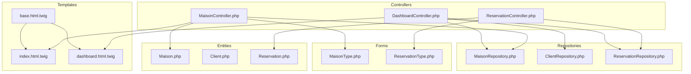
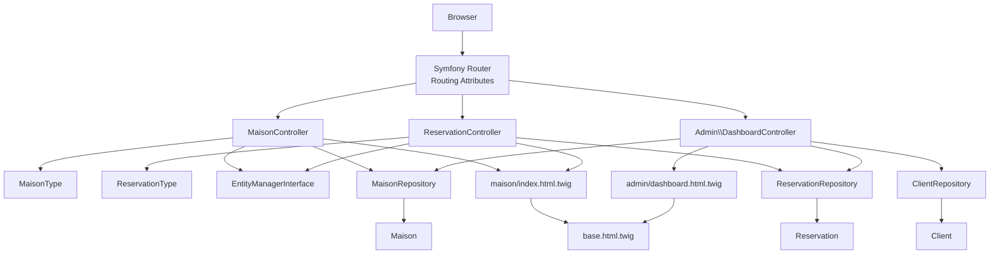
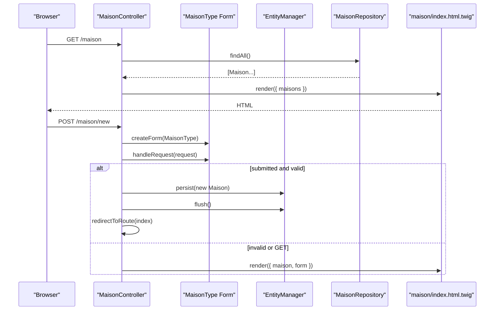
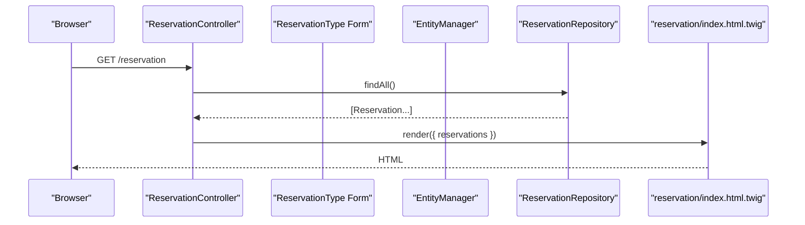
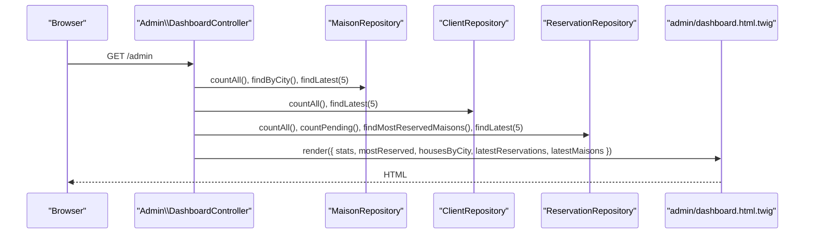
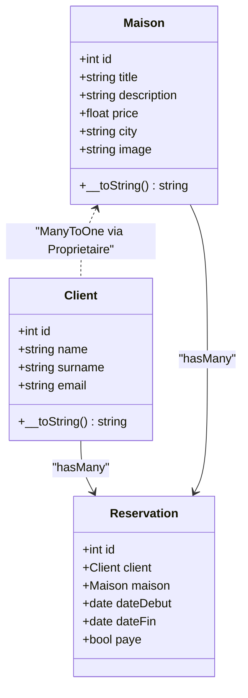
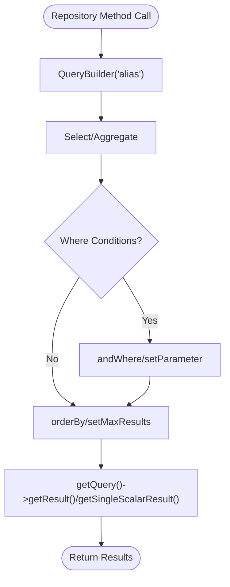
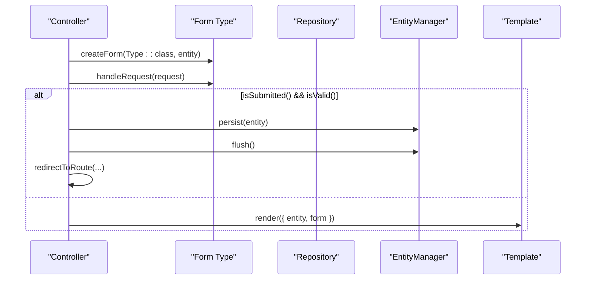
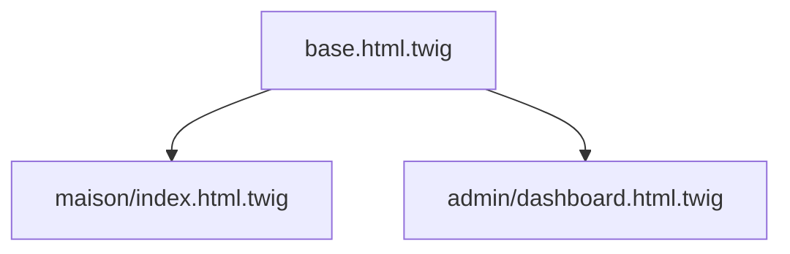
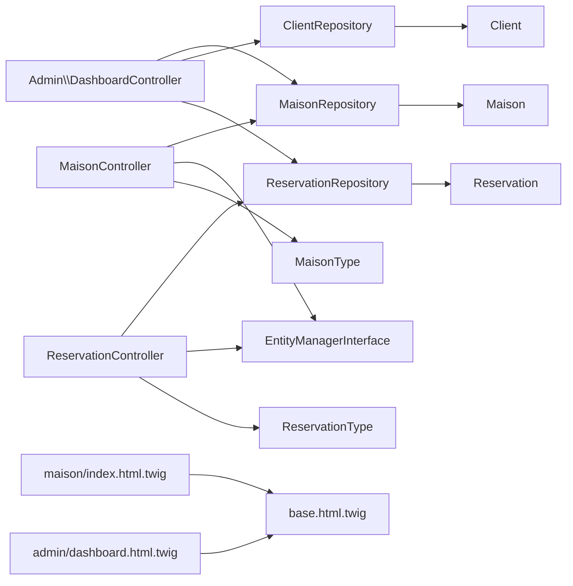

# MVC Architecture

<cite>
**Referenced Files in This Document**
- [MaisonController.php](file://src/Controller/MaisonController.php)
- [ReservationController.php](file://src/Controller/ReservationController.php)
- [DashboardController.php](file://src/Controller/Admin/DashboardController.php)
- [Maison.php](file://src/Entity/Maison.php)
- [Client.php](file://src/Entity/Client.php)
- [Reservation.php](file://src/Entity/Reservation.php)
- [MaisonRepository.php](file://src/Repository/MaisonRepository.php)
- [ClientRepository.php](file://src/Repository/ClientRepository.php)
- [ReservationRepository.php](file://src/Repository/ReservationRepository.php)
- [MaisonType.php](file://src/Form/MaisonType.php)
- [ReservationType.php](file://src/Form/ReservationType.php)
- [index.html.twig](file://templates/maison/index.html.twig)
- [dashboard.html.twig](file://templates/admin/dashboard.html.twig)
- [base.html.twig](file://templates/base.html.twig)
- [framework.yaml](file://config/packages/framework.yaml)
</cite>

## Table of Contents
1. [Introduction](#introduction)
2. [Project Structure](#project-structure)
3. [Core Components](#core-components)
4. [Architecture Overview](#architecture-overview)
5. [Detailed Component Analysis](#detailed-component-analysis)
6. [Dependency Analysis](#dependency-analysis)
7. [Performance Considerations](#performance-considerations)
8. [Troubleshooting Guide](#troubleshooting-guide)
9. [Conclusion](#conclusion)

## Introduction
This document explains the Symfony MVC architecture used in the Maisons d'Hôtes application. It details how the Model-View-Controller separation is implemented across the system, covering controllers handling HTTP requests and responses, entities representing data models with Doctrine annotations, repositories encapsulating data access logic, and Twig templates rendering views. Practical examples illustrate the flow from controller actions to repository queries and template rendering. The document also covers form components integration with validation and entity binding, and highlights the layered architecture benefits and separation of concerns.

## Project Structure
The application follows a conventional Symfony layout:
- Controllers under src/Controller (and src/Controller/Admin for the admin area)
- Entities under src/Entity
- Repositories under src/Repository
- Forms under src/Form
- Twig templates under templates (with subfolders per domain)
- Configuration under config/packages

**Diagram sources**
- [MaisonController.php:1-82](file://src/Controller/MaisonController.php#L1-L82)
- [ReservationController.php:1-82](file://src/Controller/ReservationController.php#L1-L82)
- [DashboardController.php:1-88](file://src/Controller/Admin/DashboardController.php#L1-L88)
- [Maison.php:1-118](file://src/Entity/Maison.php#L1-L118)
- [Client.php:1-71](file://src/Entity/Client.php#L1-L71)
- [Reservation.php:1-100](file://src/Entity/Reservation.php#L1-L100)
- [MaisonRepository.php:1-47](file://src/Repository/MaisonRepository.php#L1-L47)
- [ClientRepository.php:1-36](file://src/Repository/ClientRepository.php#L1-L36)
- [ReservationRepository.php:1-93](file://src/Repository/ReservationRepository.php#L1-L93)
- [MaisonType.php:1-36](file://src/Form/MaisonType.php#L1-L36)
- [ReservationType.php](file://src/Form/ReservationType.php)
- [index.html.twig:1-42](file://templates/maison/index.html.twig#L1-L42)
- [dashboard.html.twig:1-263](file://templates/admin/dashboard.html.twig#L1-L263)
- [base.html.twig:1-184](file://templates/base.html.twig#L1-L184)

**Section sources**
- [MaisonController.php:1-82](file://src/Controller/MaisonController.php#L1-L82)
- [ReservationController.php:1-82](file://src/Controller/ReservationController.php#L1-L82)
- [DashboardController.php:1-88](file://src/Controller/Admin/DashboardController.php#L1-L88)
- [Maison.php:1-118](file://src/Entity/Maison.php#L1-L118)
- [Client.php:1-71](file://src/Entity/Client.php#L1-L71)
- [Reservation.php:1-100](file://src/Entity/Reservation.php#L1-L100)
- [MaisonRepository.php:1-47](file://src/Repository/MaisonRepository.php#L1-L47)
- [ClientRepository.php:1-36](file://src/Repository/ClientRepository.php#L1-L36)
- [ReservationRepository.php:1-93](file://src/Repository/ReservationRepository.php#L1-L93)
- [MaisonType.php:1-36](file://src/Form/MaisonType.php#L1-L36)
- [ReservationType.php](file://src/Form/ReservationType.php)
- [index.html.twig:1-42](file://templates/maison/index.html.twig#L1-L42)
- [dashboard.html.twig:1-263](file://templates/admin/dashboard.html.twig#L1-L263)
- [base.html.twig:1-184](file://templates/base.html.twig#L1-L184)

## Core Components
- Model layer
  - Entities define the data model and relationships using Doctrine ORM annotations. Examples include Maison, Client, and Reservation.
  - Repositories encapsulate data access logic and expose domain-specific queries.
- View layer
  - Twig templates render HTML pages, with shared layouts and reusable blocks.
- Controller layer
  - Controllers handle HTTP requests, orchestrate forms, call repositories, and render templates.

Key characteristics:
- Controllers extend a base controller class and use attributes for routing and HTTP method constraints.
- Entities declare their repository class via annotations, enabling Doctrine to manage persistence.
- Repositories extend a service base class and use QueryBuilder for typed queries.
- Forms bind to entities and integrate with validation and CSRF protection.

**Section sources**
- [Maison.php:1-118](file://src/Entity/Maison.php#L1-L118)
- [Client.php:1-71](file://src/Entity/Client.php#L1-L71)
- [Reservation.php:1-100](file://src/Entity/Reservation.php#L1-L100)
- [MaisonRepository.php:1-47](file://src/Repository/MaisonRepository.php#L1-L47)
- [ClientRepository.php:1-36](file://src/Repository/ClientRepository.php#L1-L36)
- [ReservationRepository.php:1-93](file://src/Repository/ReservationRepository.php#L1-L93)
- [MaisonController.php:1-82](file://src/Controller/MaisonController.php#L1-L82)
- [ReservationController.php:1-82](file://src/Controller/ReservationController.php#L1-L82)
- [DashboardController.php:1-88](file://src/Controller/Admin/DashboardController.php#L1-L88)
- [MaisonType.php:1-36](file://src/Form/MaisonType.php#L1-L36)
- [ReservationType.php](file://src/Form/ReservationType.php)
- [index.html.twig:1-42](file://templates/maison/index.html.twig#L1-L42)
- [dashboard.html.twig:1-263](file://templates/admin/dashboard.html.twig#L1-L263)
- [base.html.twig:1-184](file://templates/base.html.twig#L1-L184)

## Architecture Overview
The MVC architecture separates concerns:
- Controllers receive requests, coordinate business actions, and select views.
- Models (entities and repositories) encapsulate data and query logic.
- Views (Twig) render the presentation layer.

**Diagram sources**
- [MaisonController.php:1-82](file://src/Controller/MaisonController.php#L1-L82)
- [ReservationController.php:1-82](file://src/Controller/ReservationController.php#L1-L82)
- [DashboardController.php:1-88](file://src/Controller/Admin/DashboardController.php#L1-L88)
- [MaisonRepository.php:1-47](file://src/Repository/MaisonRepository.php#L1-L47)
- [ClientRepository.php:1-36](file://src/Repository/ClientRepository.php#L1-L36)
- [ReservationRepository.php:1-93](file://src/Repository/ReservationRepository.php#L1-L93)
- [Maison.php:1-118](file://src/Entity/Maison.php#L1-L118)
- [Client.php:1-71](file://src/Entity/Client.php#L1-L71)
- [Reservation.php:1-100](file://src/Entity/Reservation.php#L1-L100)
- [MaisonType.php:1-36](file://src/Form/MaisonType.php#L1-L36)
- [ReservationType.php](file://src/Form/ReservationType.php)
- [index.html.twig:1-42](file://templates/maison/index.html.twig#L1-L42)
- [dashboard.html.twig:1-263](file://templates/admin/dashboard.html.twig#L1-L263)
- [base.html.twig:1-184](file://templates/base.html.twig#L1-L184)

## Detailed Component Analysis

### MaisonController: Request Handling and Rendering
- Index action fetches all Maisons via the repository and renders the index template.
- New action creates a form bound to a Maison entity, handles submission and validation, persists the entity, and redirects.
- Show action renders a single Maison.
- Edit action binds an existing Maison to the form, validates, flushes changes, and redirects.
- Delete action validates a CSRF token, removes the entity, flushes, and redirects.

**Diagram sources**
- [MaisonController.php:17-43](file://src/Controller/MaisonController.php#L17-L43)
- [MaisonRepository.php:1-47](file://src/Repository/MaisonRepository.php#L1-L47)
- [MaisonType.php:1-36](file://src/Form/MaisonType.php#L1-L36)
- [index.html.twig:1-42](file://templates/maison/index.html.twig#L1-L42)

**Section sources**
- [MaisonController.php:1-82](file://src/Controller/MaisonController.php#L1-L82)
- [MaisonRepository.php:1-47](file://src/Repository/MaisonRepository.php#L1-L47)
- [MaisonType.php:1-36](file://src/Form/MaisonType.php#L1-L36)
- [index.html.twig:1-42](file://templates/maison/index.html.twig#L1-L42)

### ReservationController: CRUD with Forms and Validation
- Mirrors the MaisonController pattern for reservations, including form creation, validation, persistence, and redirection.
- Uses a dedicated Reservation entity with relationships to Client and Maison.

**Diagram sources**
- [ReservationController.php:17-23](file://src/Controller/ReservationController.php#L17-L23)
- [ReservationRepository.php:1-93](file://src/Repository/ReservationRepository.php#L1-L93)
- [ReservationType.php](file://src/Form/ReservationType.php)

**Section sources**
- [ReservationController.php:1-82](file://src/Controller/ReservationController.php#L1-L82)
- [ReservationRepository.php:1-93](file://src/Repository/ReservationRepository.php#L1-L93)
- [Reservation.php:1-100](file://src/Entity/Reservation.php#L1-L100)

### Admin DashboardController: Aggregation and Reporting
- Aggregates statistics using repositories (counts, latest items, grouped metrics).
- Renders an admin dashboard template with charts and tables.

**Diagram sources**
- [DashboardController.php:32-61](file://src/Controller/Admin/DashboardController.php#L32-L61)
- [MaisonRepository.php:19-45](file://src/Repository/MaisonRepository.php#L19-L45)
- [ClientRepository.php:19-34](file://src/Repository/ClientRepository.php#L19-L34)
- [ReservationRepository.php:20-91](file://src/Repository/ReservationRepository.php#L20-L91)
- [dashboard.html.twig:1-263](file://templates/admin/dashboard.html.twig#L1-L263)

**Section sources**
- [DashboardController.php:1-88](file://src/Controller/Admin/DashboardController.php#L1-L88)
- [MaisonRepository.php:1-47](file://src/Repository/MaisonRepository.php#L1-L47)
- [ClientRepository.php:1-36](file://src/Repository/ClientRepository.php#L1-L36)
- [ReservationRepository.php:1-93](file://src/Repository/ReservationRepository.php#L1-L93)
- [dashboard.html.twig:1-263](file://templates/admin/dashboard.html.twig#L1-L263)

### Entities: Data Models with Doctrine Annotations
- Entities declare their repository class and column/relationship mappings.
- Example fields and relationships:
  - Maison: identifiers, attributes, and a ManyToOne relationship to Proprietaire.
  - Client: personal details.
  - Reservation: dates, payment status, and ManyToOne to Client and Maison.

**Diagram sources**
- [Maison.php:1-118](file://src/Entity/Maison.php#L1-L118)
- [Client.php:1-71](file://src/Entity/Client.php#L1-L71)
- [Reservation.php:1-100](file://src/Entity/Reservation.php#L1-L100)

**Section sources**
- [Maison.php:1-118](file://src/Entity/Maison.php#L1-L118)
- [Client.php:1-71](file://src/Entity/Client.php#L1-L71)
- [Reservation.php:1-100](file://src/Entity/Reservation.php#L1-L100)

### Repositories: Encapsulated Data Access
- Repositories extend a service base class and use QueryBuilder for typed queries.
- Examples:
  - Counting records, finding latest items, grouped aggregations.
  - Specialized queries like most reserved houses and monthly revenue.

**Diagram sources**
- [MaisonRepository.php:19-45](file://src/Repository/MaisonRepository.php#L19-L45)
- [ClientRepository.php:19-34](file://src/Repository/ClientRepository.php#L19-L34)
- [ReservationRepository.php:20-91](file://src/Repository/ReservationRepository.php#L20-L91)

**Section sources**
- [MaisonRepository.php:1-47](file://src/Repository/MaisonRepository.php#L1-L47)
- [ClientRepository.php:1-36](file://src/Repository/ClientRepository.php#L1-L36)
- [ReservationRepository.php:1-93](file://src/Repository/ReservationRepository.php#L1-L93)

### Forms: Validation and Entity Binding
- Form types define fields mapped to entity properties.
- Controllers create forms, bind request data, validate, and persist entities when valid.

**Diagram sources**
- [MaisonController.php:25-43](file://src/Controller/MaisonController.php#L25-L43)
- [MaisonType.php:1-36](file://src/Form/MaisonType.php#L1-L36)
- [ReservationController.php:25-43](file://src/Controller/ReservationController.php#L25-L43)
- [ReservationType.php](file://src/Form/ReservationType.php)

**Section sources**
- [MaisonType.php:1-36](file://src/Form/MaisonType.php#L1-L36)
- [ReservationType.php](file://src/Form/ReservationType.php)
- [MaisonController.php:25-43](file://src/Controller/MaisonController.php#L25-L43)
- [ReservationController.php:25-43](file://src/Controller/ReservationController.php#L25-L43)

### Views: Twig Templates and Layout
- Base layout provides navigation, flash messages, and shared styling.
- Domain-specific templates extend the base and render lists, forms, and details.
- Admin dashboard leverages EasyAdmin’s layout while integrating custom blocks.

**Diagram sources**
- [base.html.twig:1-184](file://templates/base.html.twig#L1-L184)
- [index.html.twig:1-42](file://templates/maison/index.html.twig#L1-L42)
- [dashboard.html.twig:1-263](file://templates/admin/dashboard.html.twig#L1-L263)

**Section sources**
- [base.html.twig:1-184](file://templates/base.html.twig#L1-L184)
- [index.html.twig:1-42](file://templates/maison/index.html.twig#L1-L42)
- [dashboard.html.twig:1-263](file://templates/admin/dashboard.html.twig#L1-L263)

## Dependency Analysis
- Controllers depend on:
  - Repositories for data retrieval
  - Forms for validation and binding
  - EntityManager for persistence
  - Twig for rendering
- Repositories depend on:
  - Doctrine’s ManagerRegistry and QueryBuilder
- Entities depend on:
  - Doctrine ORM annotations and relationships
- Forms depend on:
  - Symfony Form components and entity classes

**Diagram sources**
- [MaisonController.php:1-82](file://src/Controller/MaisonController.php#L1-L82)
- [ReservationController.php:1-82](file://src/Controller/ReservationController.php#L1-L82)
- [DashboardController.php:1-88](file://src/Controller/Admin/DashboardController.php#L1-L88)
- [MaisonRepository.php:1-47](file://src/Repository/MaisonRepository.php#L1-L47)
- [ClientRepository.php:1-36](file://src/Repository/ClientRepository.php#L1-L36)
- [ReservationRepository.php:1-93](file://src/Repository/ReservationRepository.php#L1-L93)
- [MaisonType.php:1-36](file://src/Form/MaisonType.php#L1-L36)
- [ReservationType.php](file://src/Form/ReservationType.php)
- [Maison.php:1-118](file://src/Entity/Maison.php#L1-L118)
- [Client.php:1-71](file://src/Entity/Client.php#L1-L71)
- [Reservation.php:1-100](file://src/Entity/Reservation.php#L1-L100)
- [index.html.twig:1-42](file://templates/maison/index.html.twig#L1-L42)
- [dashboard.html.twig:1-263](file://templates/admin/dashboard.html.twig#L1-L263)
- [base.html.twig:1-184](file://templates/base.html.twig#L1-L184)

**Section sources**
- [MaisonController.php:1-82](file://src/Controller/MaisonController.php#L1-L82)
- [ReservationController.php:1-82](file://src/Controller/ReservationController.php#L1-L82)
- [DashboardController.php:1-88](file://src/Controller/Admin/DashboardController.php#L1-L88)
- [MaisonRepository.php:1-47](file://src/Repository/MaisonRepository.php#L1-L47)
- [ClientRepository.php:1-36](file://src/Repository/ClientRepository.php#L1-L36)
- [ReservationRepository.php:1-93](file://src/Repository/ReservationRepository.php#L1-L93)
- [MaisonType.php:1-36](file://src/Form/MaisonType.php#L1-L36)
- [ReservationType.php](file://src/Form/ReservationType.php)
- [Maison.php:1-118](file://src/Entity/Maison.php#L1-L118)
- [Client.php:1-71](file://src/Entity/Client.php#L1-L71)
- [Reservation.php:1-100](file://src/Entity/Reservation.php#L1-L100)
- [index.html.twig:1-42](file://templates/maison/index.html.twig#L1-L42)
- [dashboard.html.twig:1-263](file://templates/admin/dashboard.html.twig#L1-L263)
- [base.html.twig:1-184](file://templates/base.html.twig#L1-L184)

## Performance Considerations
- Prefer repository methods that leverage QueryBuilder to avoid loading unnecessary data.
- Use pagination or limit clauses for large datasets.
- Minimize N+1 queries by eager-loading related entities when appropriate.
- Cache frequently accessed aggregates (e.g., counts) at the repository level if needed.
- Keep Twig templates efficient by avoiding heavy logic inside loops.

## Troubleshooting Guide
- CSRF validation failures during delete operations:
  - Ensure the CSRF token is present in the request payload and matches the expected token format.
  - Verify the token generation in the delete form and the controller’s token validation.
- Form validation errors:
  - Confirm that form fields match entity properties and that validation constraints are configured.
  - Check for proper form binding and submission handling in controller actions.
- Session and flash messages:
  - Review framework configuration for sessions and ensure flash handling in the base template.
- Redirect loops:
  - Validate route names and parameters used in redirectToRoute calls.

**Section sources**
- [MaisonController.php:71-80](file://src/Controller/MaisonController.php#L71-L80)
- [ReservationController.php:71-80](file://src/Controller/ReservationController.php#L71-L80)
- [framework.yaml:1-16](file://config/packages/framework.yaml#L1-L16)
- [base.html.twig:164-171](file://templates/base.html.twig#L164-L171)

## Conclusion
The Maisons d'Hôtes application demonstrates a clean Symfony MVC architecture with strong separation of concerns. Controllers orchestrate requests and responses, entities model the domain with Doctrine, repositories encapsulate data access, and Twig templates render views. Forms integrate validation and entity binding, while the admin dashboard aggregates data through repositories. This layered approach improves maintainability, testability, and scalability.