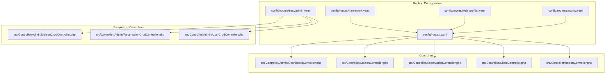
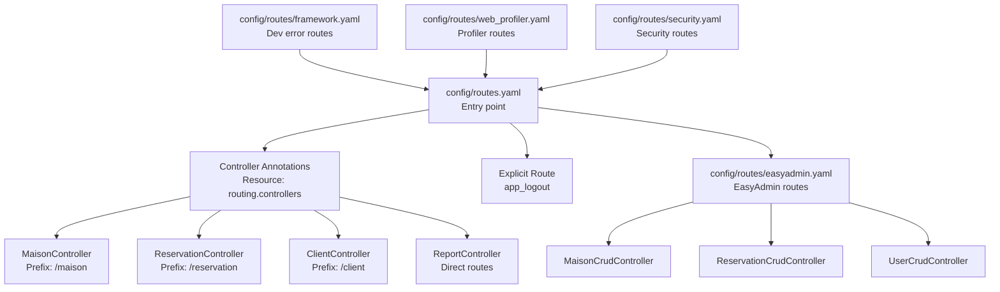
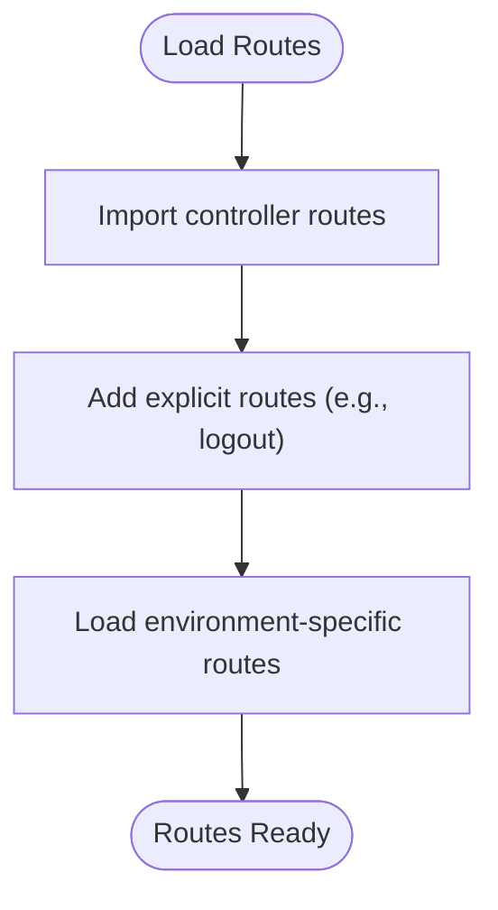
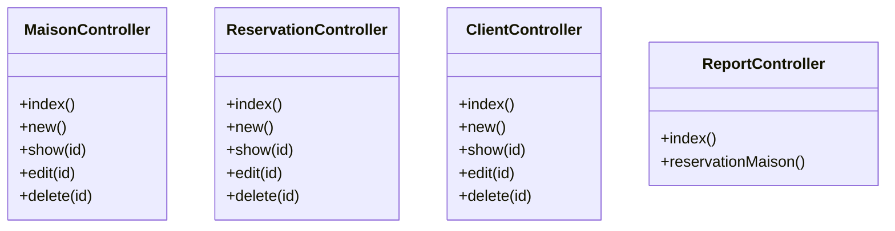
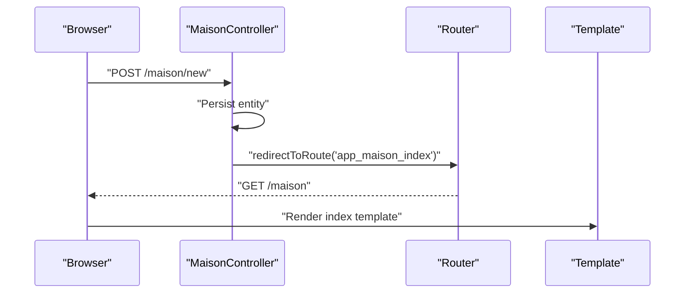
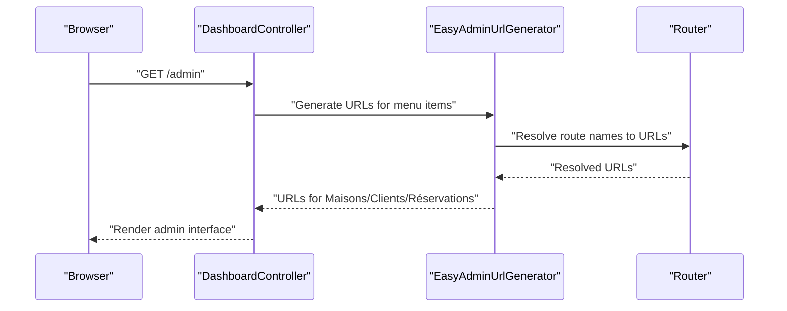
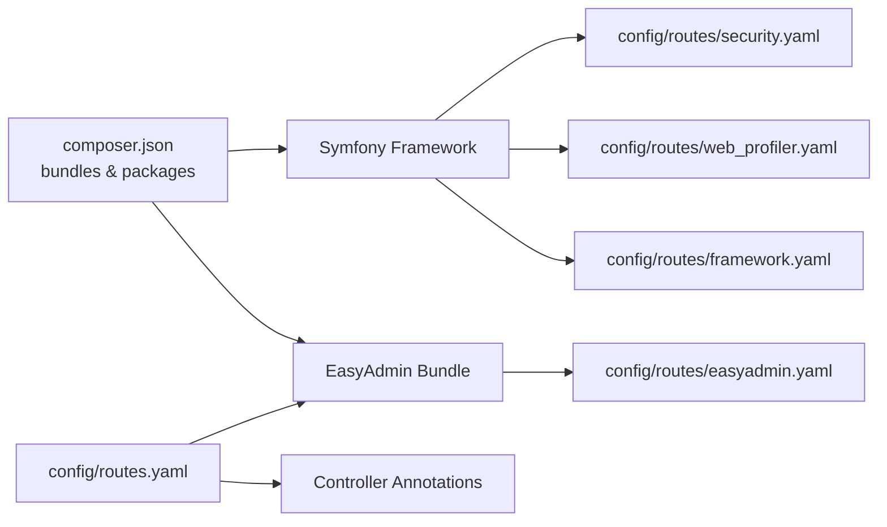

# Routing and URL Management

<cite>
**Referenced Files in This Document**
- [routes.yaml](file://config/routes.yaml)
- [routing.yaml](file://config/packages/routing.yaml)
- [framework.yaml](file://config/routes/framework.yaml)
- [web_profiler.yaml](file://config/routes/web_profiler.yaml)
- [security.yaml](file://config/routes/security.yaml)
- [easyadmin.yaml](file://config/routes/easyadmin.yaml)
- [DashboardController.php](file://src/Controller/Admin/DashboardController.php)
- [MaisonController.php](file://src/Controller/MaisonController.php)
- [ReservationController.php](file://src/Controller/ReservationController.php)
- [ClientController.php](file://src/Controller/ClientController.php)
- [MaisonCrudController.php](file://src/Controller/Admin/MaisonCrudController.php)
- [ReservationCrudController.php](file://src/Controller/Admin/ReservationCrudController.php)
- [UserCrudController.php](file://src/Controller/Admin/UserCrudController.php)
- [ReportController.php](file://src/Controller/ReportController.php)
- [composer.json](file://composer.json)
</cite>

## Table of Contents
1. [Introduction](#introduction)
2. [Project Structure](#project-structure)
3. [Core Components](#core-components)
4. [Architecture Overview](#architecture-overview)
5. [Detailed Component Analysis](#detailed-component-analysis)
6. [Dependency Analysis](#dependency-analysis)
7. [Performance Considerations](#performance-considerations)
8. [Troubleshooting Guide](#troubleshooting-guide)
9. [Conclusion](#conclusion)
10. [Appendices](#appendices)

## Introduction
This document explains the Symfony routing system implementation in the project, focusing on route definition patterns, URL generation, route parameters, and collections. It covers how central routing configuration integrates with controller route annotations, RESTful patterns for CRUD operations, EasyAdmin integration, and practical examples such as property listing routes, reservation management URLs, and administrative routes. It also includes guidance on route debugging, performance optimization, best practices for clean URLs, and production considerations including route caching.

## Project Structure
Routing is configured centrally and extended via controller annotations and third-party bundles. The primary entry point for application routes is the central routes file, which imports controllers and defines a logout route. Additional routing is provided by framework-specific route sets (development errors, profiler), security logout routes, and EasyAdmin.

**Diagram sources**
- [routes.yaml:1-15](file://config/routes.yaml#L1-L15)
- [framework.yaml:1-5](file://config/routes/framework.yaml#L1-L5)
- [web_profiler.yaml:1-9](file://config/routes/web_profiler.yaml#L1-L9)
- [security.yaml:1-4](file://config/routes/security.yaml#L1-L4)
- [easyadmin.yaml:1-4](file://config/routes/easyadmin.yaml#L1-L4)
- [DashboardController.php:20-22](file://src/Controller/Admin/DashboardController.php#L20-L22)
- [MaisonController.php:14-15](file://src/Controller/MaisonController.php#L14-L15)
- [ReservationController.php:14-15](file://src/Controller/ReservationController.php#L14-L15)
- [ClientController.php:14-15](file://src/Controller/ClientController.php#L14-L15)
- [ReportController.php:15-15](file://src/Controller/ReportController.php#L15-L15)
- [MaisonCrudController.php:16-21](file://src/Controller/Admin/MaisonCrudController.php#L16-L21)
- [ReservationCrudController.php:15-20](file://src/Controller/Admin/ReservationCrudController.php#L15-L20)
- [UserCrudController.php:15-20](file://src/Controller/Admin/UserCrudController.php#L15-L20)

**Section sources**
- [routes.yaml:1-15](file://config/routes.yaml#L1-L15)
- [routing.yaml:1-11](file://config/packages/routing.yaml#L1-L11)
- [framework.yaml:1-5](file://config/routes/framework.yaml#L1-L5)
- [web_profiler.yaml:1-9](file://config/routes/web_profiler.yaml#L1-L9)
- [security.yaml:1-4](file://config/routes/security.yaml#L1-L4)
- [easyadmin.yaml:1-4](file://config/routes/easyadmin.yaml#L1-L4)

## Core Components
- Central routing configuration: Defines the application’s route collection entry point and a logout route.
- Controller route annotations: Define RESTful routes under hierarchical prefixes for property listings, reservations, clients, and reports.
- EasyAdmin integration: Uses attributes to create admin dashboards and menu items that link to CRUD routes.
- URL generation: Controllers use route names to redirect after form submissions; EasyAdmin provides URL generation utilities for navigation.

Key routing behaviors:
- Route collections are defined per controller class with a shared prefix.
- Individual action routes specify HTTP methods and optional parameters.
- Route names are scoped with a consistent prefix to avoid collisions.
- URL generation leverages named routes for redirects and links.

**Section sources**
- [routes.yaml:10-15](file://config/routes.yaml#L10-L15)
- [MaisonController.php:14-81](file://src/Controller/MaisonController.php#L14-L81)
- [ReservationController.php:14-81](file://src/Controller/ReservationController.php#L14-L81)
- [ClientController.php:14-81](file://src/Controller/ClientController.php#L14-L81)
- [ReportController.php:15-53](file://src/Controller/ReportController.php#L15-L53)
- [DashboardController.php:20-86](file://src/Controller/Admin/DashboardController.php#L20-L86)

## Architecture Overview
The routing architecture combines:
- Central route loading via the routes file.
- Controller-based route annotations for domain resources.
- EasyAdmin-generated routes for administration.
- Environment-specific route sets for development and security.

**Diagram sources**
- [routes.yaml:10-15](file://config/routes.yaml#L10-L15)
- [MaisonController.php:14-15](file://src/Controller/MaisonController.php#L14-L15)
- [ReservationController.php:14-15](file://src/Controller/ReservationController.php#L14-L15)
- [ClientController.php:14-15](file://src/Controller/ClientController.php#L14-L15)
- [ReportController.php:15-15](file://src/Controller/ReportController.php#L15-L15)
- [MaisonCrudController.php:16-21](file://src/Controller/Admin/MaisonCrudController.php#L16-L21)
- [ReservationCrudController.php:15-20](file://src/Controller/Admin/ReservationCrudController.php#L15-L20)
- [UserCrudController.php:15-20](file://src/Controller/Admin/UserCrudController.php#L15-L20)
- [framework.yaml:1-5](file://config/routes/framework.yaml#L1-L5)
- [web_profiler.yaml:1-9](file://config/routes/web_profiler.yaml#L1-L9)
- [security.yaml:1-4](file://config/routes/security.yaml#L1-L4)
- [easyadmin.yaml:1-4](file://config/routes/easyadmin.yaml#L1-L4)

## Detailed Component Analysis

### Central Routing Configuration
- The central routes file imports controller routes and defines a logout route.
- The framework router configuration sets a default URI for non-HTTP contexts and adjusts strict requirements in production.

**Section sources**
- [routes.yaml:10-15](file://config/routes.yaml#L10-L15)
- [routing.yaml:1-11](file://config/packages/routing.yaml#L1-L11)

### Controller Route Annotations and RESTful Patterns
Controllers define hierarchical route prefixes and individual actions for standard CRUD operations. Each action specifies HTTP methods and optional route parameters.

**Diagram sources**
- [MaisonController.php:14-81](file://src/Controller/MaisonController.php#L14-L81)
- [ReservationController.php:14-81](file://src/Controller/ReservationController.php#L14-L81)
- [ClientController.php:14-81](file://src/Controller/ClientController.php#L14-L81)
- [ReportController.php:15-53](file://src/Controller/ReportController.php#L15-L53)

**Section sources**
- [MaisonController.php:14-81](file://src/Controller/MaisonController.php#L14-L81)
- [ReservationController.php:14-81](file://src/Controller/ReservationController.php#L14-L81)
- [ClientController.php:14-81](file://src/Controller/ClientController.php#L14-L81)
- [ReportController.php:15-53](file://src/Controller/ReportController.php#L15-L53)

### URL Generation and Redirects
Controllers redirect to named routes after successful operations. This ensures clean URLs and consistent navigation.

**Diagram sources**
- [MaisonController.php:36-36](file://src/Controller/MaisonController.php#L36-L36)
- [MaisonController.php:62-62](file://src/Controller/MaisonController.php#L62-L62)
- [MaisonController.php:79-79](file://src/Controller/MaisonController.php#L79-L79)

**Section sources**
- [MaisonController.php:36-36](file://src/Controller/MaisonController.php#L36-L36)
- [MaisonController.php:62-62](file://src/Controller/MaisonController.php#L62-L62)
- [MaisonController.php:79-79](file://src/Controller/MaisonController.php#L79-L79)

### Property Listing Routes
Property listing routes follow a RESTful pattern under a shared prefix, with explicit route names for index, creation, viewing, editing, and deletion.

- Prefix: /maison
- Routes: index, new, show{id}, edit{id}, delete{id}
- HTTP methods: GET for listing and viewing; GET/POST for creation and editing; POST for deletion

**Section sources**
- [MaisonController.php:17-23](file://src/Controller/MaisonController.php#L17-L23)
- [MaisonController.php:25-43](file://src/Controller/MaisonController.php#L25-L43)
- [MaisonController.php:45-51](file://src/Controller/MaisonController.php#L45-L51)
- [MaisonController.php:53-69](file://src/Controller/MaisonController.php#L53-L69)
- [MaisonController.php:71-80](file://src/Controller/MaisonController.php#L71-L80)

### Reservation Management URLs
Reservation management mirrors the property listing pattern with a dedicated prefix and consistent route naming.

- Prefix: /reservation
- Routes: index, new, show{id}, edit{id}, delete{id}
- HTTP methods: GET for listing and viewing; GET/POST for creation and editing; POST for deletion

**Section sources**
- [ReservationController.php:17-23](file://src/Controller/ReservationController.php#L17-L23)
- [ReservationController.php:25-43](file://src/Controller/ReservationController.php#L25-L43)
- [ReservationController.php:45-51](file://src/Controller/ReservationController.php#L45-L51)
- [ReservationController.php:53-69](file://src/Controller/ReservationController.php#L53-L69)
- [ReservationController.php:71-80](file://src/Controller/ReservationController.php#L71-L80)

### Administrative Routes with EasyAdmin
The admin dashboard uses an attribute to define the admin route path and name. Menu items link to CRUD controllers using route names generated by EasyAdmin.

**Diagram sources**
- [DashboardController.php:20-22](file://src/Controller/Admin/DashboardController.php#L20-L22)
- [DashboardController.php:71-86](file://src/Controller/Admin/DashboardController.php#L71-L86)
- [MaisonCrudController.php:16-21](file://src/Controller/Admin/MaisonCrudController.php#L16-L21)
- [ReservationCrudController.php:15-20](file://src/Controller/Admin/ReservationCrudController.php#L15-L20)
- [UserCrudController.php:15-20](file://src/Controller/Admin/UserCrudController.php#L15-L20)

**Section sources**
- [DashboardController.php:20-22](file://src/Controller/Admin/DashboardController.php#L20-L22)
- [DashboardController.php:71-86](file://src/Controller/Admin/DashboardController.php#L71-L86)
- [MaisonCrudController.php:16-21](file://src/Controller/Admin/MaisonCrudController.php#L16-L21)
- [ReservationCrudController.php:15-20](file://src/Controller/Admin/ReservationCrudController.php#L15-L20)
- [UserCrudController.php:15-20](file://src/Controller/Admin/UserCrudController.php#L15-L20)

### Reports and Specialized Routes
Report routes demonstrate direct route definitions for specialized views, including a GET form for filtering.

- Route: /most-reserved-maisons → named route
- Route: /reservation-maison → named route with GET form handling

**Section sources**
- [ReportController.php:15-22](file://src/Controller/ReportController.php#L15-L22)
- [ReportController.php:24-53](file://src/Controller/ReportController.php#L24-L53)

## Dependency Analysis
Routing depends on:
- Central route loader importing controller routes.
- EasyAdmin bundle providing attribute-driven dashboard and CRUD route generation.
- Environment-specific route sets for development and security.

**Diagram sources**
- [composer.json:14-14](file://composer.json#L14-L14)
- [routes.yaml:10-15](file://config/routes.yaml#L10-L15)
- [easyadmin.yaml:1-4](file://config/routes/easyadmin.yaml#L1-L4)
- [framework.yaml:1-5](file://config/routes/framework.yaml#L1-L5)
- [web_profiler.yaml:1-9](file://config/routes/web_profiler.yaml#L1-L9)
- [security.yaml:1-4](file://config/routes/security.yaml#L1-L4)

**Section sources**
- [composer.json:14-14](file://composer.json#L14-L14)
- [routes.yaml:10-15](file://config/routes.yaml#L10-L15)
- [easyadmin.yaml:1-4](file://config/routes/easyadmin.yaml#L1-L4)

## Performance Considerations
- Route caching: Enable route caching in production to reduce runtime overhead. The framework’s router configuration supports production tuning.
- Strict requirements: Production disables strict requirement checking to improve performance and stability.
- Minimal wildcard routes: Prefer explicit route parameters to avoid ambiguous matches and reduce matching overhead.
- Keep route names concise but descriptive to simplify URL generation and debugging.

**Section sources**
- [routing.yaml:7-11](file://config/packages/routing.yaml#L7-L11)

## Troubleshooting Guide
- List registered routes: Use the console command to inspect all routes and confirm route names and paths.
- Verify controller annotations: Ensure route prefixes and names match expectations.
- Check EasyAdmin menu items: Confirm that route names used in menu items correspond to generated routes.
- Environment-specific routes: Ensure development and profiler routes are only loaded in appropriate environments.

**Section sources**
- [routes.yaml:7-8](file://config/routes.yaml#L7-L8)
- [framework.yaml:1-5](file://config/routes/framework.yaml#L1-L5)
- [web_profiler.yaml:1-9](file://config/routes/web_profiler.yaml#L1-L9)
- [security.yaml:1-4](file://config/routes/security.yaml#L1-L4)

## Conclusion
The project employs a clean, scalable routing architecture:
- Central route loading with controller annotations for domain resources.
- RESTful patterns for CRUD operations with consistent naming and HTTP method usage.
- EasyAdmin integration for administration with attribute-driven dashboard and CRUD routes.
- Environment-aware routing for development and security.
Adhering to these patterns ensures maintainable, predictable URLs and efficient route resolution, especially in production with caching and tuned router settings.

## Appendices

### Best Practices for Clean URL Structures
- Use hierarchical prefixes for related resources.
- Keep route names short, consistent, and descriptive.
- Prefer explicit parameters over wildcards.
- Group related routes under a single controller with a shared prefix.
- Leverage named routes for redirects and links.

### Production Considerations
- Enable route caching.
- Disable strict requirements in production.
- Load environment-specific routes only in development.
- Validate route names and parameters during deployment.