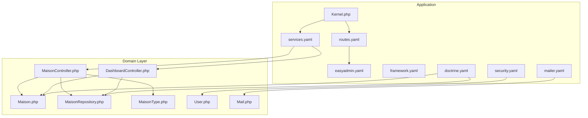
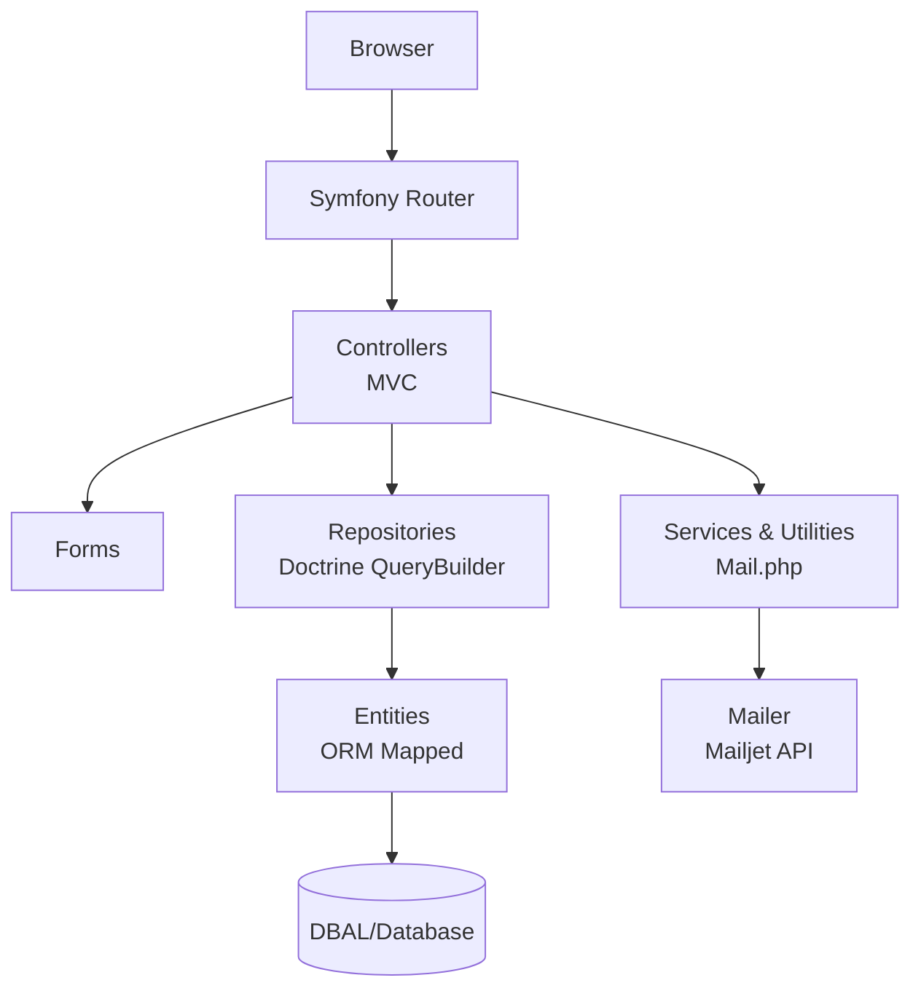
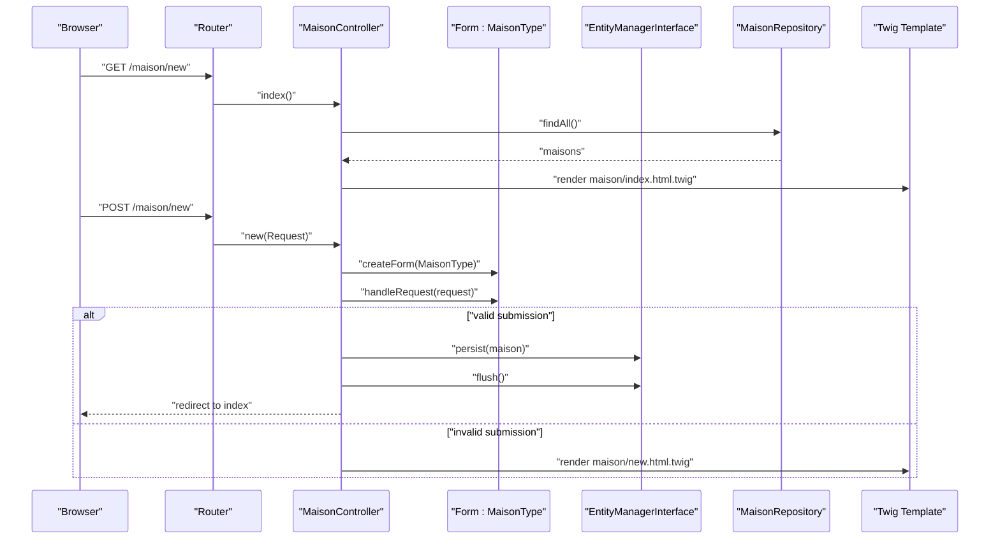
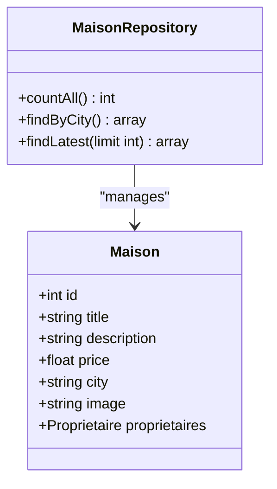
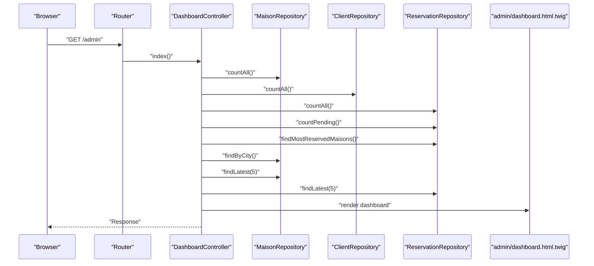
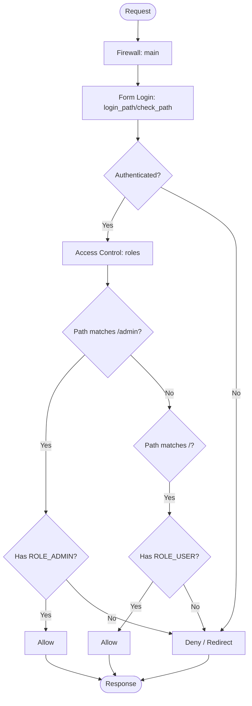
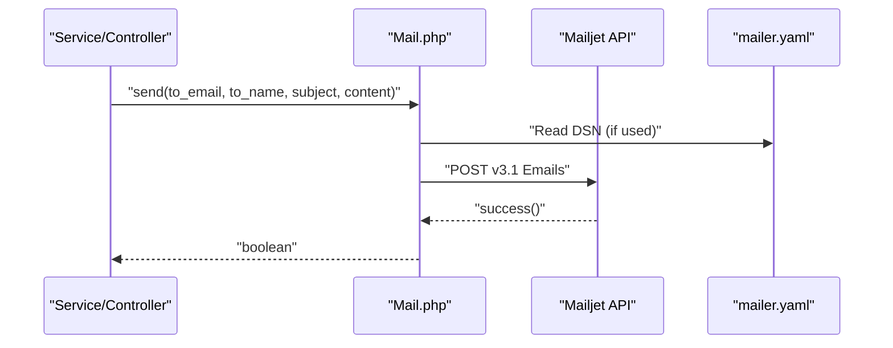
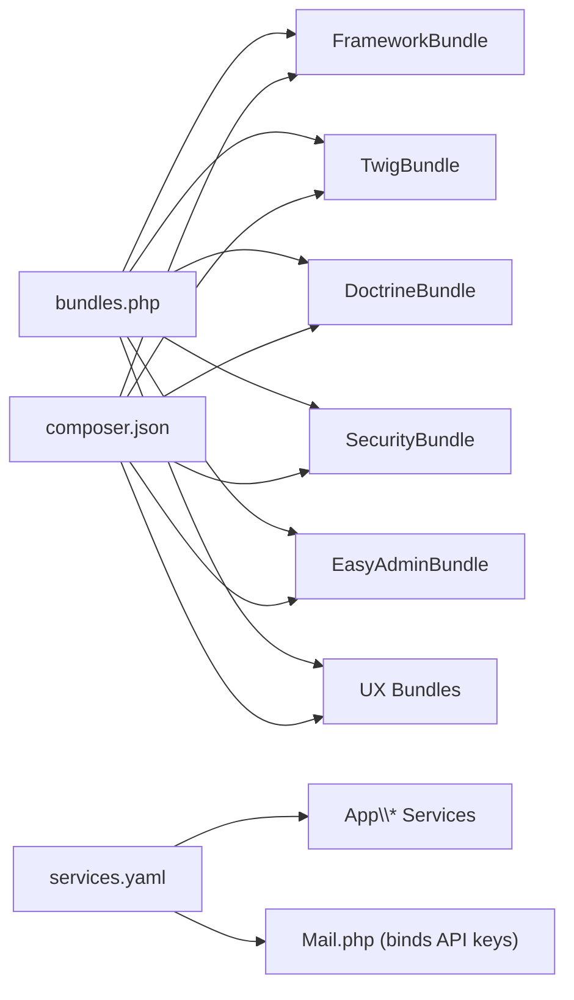

# System Architecture

<cite>
**Referenced Files in This Document**
- [composer.json](file://composer.json)
- [bundles.php](file://config/bundles.php)
- [Kernel.php](file://src/Kernel.php)
- [services.yaml](file://config/services.yaml)
- [framework.yaml](file://config/packages/framework.yaml)
- [security.yaml](file://config/packages/security.yaml)
- [doctrine.yaml](file://config/packages/doctrine.yaml)
- [mailer.yaml](file://config/packages/mailer.yaml)
- [routes.yaml](file://config/routes.yaml)
- [easyadmin.yaml](file://config/routes/easyadmin.yaml)
- [MaisonController.php](file://src/Controller/MaisonController.php)
- [DashboardController.php](file://src/Controller/Admin/DashboardController.php)
- [Maison.php](file://src/Entity/Maison.php)
- [MaisonRepository.php](file://src/Repository/MaisonRepository.php)
- [MaisonType.php](file://src/Form/MaisonType.php)
- [User.php](file://src/Entity/User.php)
- [Mail.php](file://src/Classe/Mail.php)
</cite>

## Table of Contents
1. [Introduction](#introduction)
2. [Project Structure](#project-structure)
3. [Core Components](#core-components)
4. [Architecture Overview](#architecture-overview)
5. [Detailed Component Analysis](#detailed-component-analysis)
6. [Dependency Analysis](#dependency-analysis)
7. [Performance Considerations](#performance-considerations)
8. [Troubleshooting Guide](#troubleshooting-guide)
9. [Conclusion](#conclusion)

## Introduction
This document describes the architectural design of the Maisons d'Hôtes system built with Symfony 7.4. It explains the MVC separation, dependency injection container configuration, service layer organization, routing, and bundle integration patterns. It documents the layered architecture (controllers, services, repositories, entities), the data flow from HTTP requests to persistence, system boundaries, external integrations (Mailjet, EasyAdmin), and security/session management. Architectural decisions and cross-cutting concerns are clarified with diagrams and references to concrete source files.

## Project Structure
The project follows Symfony’s conventional structure with clear separation of concerns:
- src/ contains controllers, entities, repositories, forms, and a dedicated service-like class for email.
- config/ holds Symfony configuration files for packages, routing, services, and environment-specific overrides.
- templates/ contains Twig views organized by domain (client, login, maison, proprietaire, registration, report, reservation, reset_password).
- public/ serves the front controller and static assets.
- migrations/ stores Doctrine migrations.
- tests/ contains test bootstrapping.

Key configuration entry points:
- Kernel defines the micro-kernel behavior.
- bundles.php registers enabled bundles.
- services.yaml configures DI parameters and service autowiring.
- routes.yaml and routes/easyadmin.yaml define routing resources.
- doctrine.yaml, security.yaml, framework.yaml, and mailer.yaml configure ORM, security, sessions, and mailer.

**Diagram sources**
- [Kernel.php:1-12](file://src/Kernel.php#L1-L12)
- [services.yaml:1-29](file://config/services.yaml#L1-L29)
- [routes.yaml:1-15](file://config/routes.yaml#L1-L15)
- [easyadmin.yaml:1-4](file://config/routes/easyadmin.yaml#L1-L4)
- [framework.yaml:1-16](file://config/packages/framework.yaml#L1-L16)
- [security.yaml:1-55](file://config/packages/security.yaml#L1-L55)
- [doctrine.yaml:1-55](file://config/packages/doctrine.yaml#L1-L55)
- [mailer.yaml:1-4](file://config/packages/mailer.yaml#L1-L4)
- [MaisonController.php:1-82](file://src/Controller/MaisonController.php#L1-L82)
- [DashboardController.php:1-88](file://src/Controller/Admin/DashboardController.php#L1-L88)
- [Maison.php:1-118](file://src/Entity/Maison.php#L1-L118)
- [MaisonRepository.php:1-47](file://src/Repository/MaisonRepository.php#L1-L47)
- [MaisonType.php:1-36](file://src/Form/MaisonType.php#L1-L36)
- [User.php:1-119](file://src/Entity/User.php#L1-L119)
- [Mail.php:1-48](file://src/Classe/Mail.php#L1-L48)

**Section sources**
- [composer.json:1-111](file://composer.json#L1-L111)
- [bundles.php:1-19](file://config/bundles.php#L1-L19)
- [Kernel.php:1-12](file://src/Kernel.php#L1-L12)
- [services.yaml:1-29](file://config/services.yaml#L1-L29)
- [routes.yaml:1-15](file://config/routes.yaml#L1-L15)
- [easyadmin.yaml:1-4](file://config/routes/easyadmin.yaml#L1-L4)
- [framework.yaml:1-16](file://config/packages/framework.yaml#L1-L16)
- [security.yaml:1-55](file://config/packages/security.yaml#L1-L55)
- [doctrine.yaml:1-55](file://config/packages/doctrine.yaml#L1-L55)
- [mailer.yaml:1-4](file://config/packages/mailer.yaml#L1-L4)

## Core Components
- Controllers: Handle HTTP requests, orchestrate forms, and render Twig templates. Examples:
  - MaisonController manages CRUD for houses.
  - DashboardController integrates EasyAdmin and aggregates statistics.
- Entities: Define domain objects with Doctrine ORM mapping.
  - Maison represents house listings with relationships to owners.
  - User implements security interfaces for authentication.
- Repositories: Encapsulate data access queries using Doctrine’s query builder.
  - MaisonRepository provides counts, aggregations, and latest items.
- Forms: Type-safe forms bound to entities.
  - MaisonType binds house creation/editing with related owner selection.
- Services and Utilities:
  - services.yaml configures autowiring and binds Mailjet API keys.
  - Mail.php wraps Mailjet API client for sending templated emails.
- Routing and Security:
  - routes.yaml imports controllers and defines logout route.
  - security.yaml configures password hashing, user provider, form login, logout, and access control.
  - framework.yaml enables sessions and sets secrets.

**Section sources**
- [MaisonController.php:1-82](file://src/Controller/MaisonController.php#L1-L82)
- [DashboardController.php:1-88](file://src/Controller/Admin/DashboardController.php#L1-L88)
- [Maison.php:1-118](file://src/Entity/Maison.php#L1-L118)
- [MaisonRepository.php:1-47](file://src/Repository/MaisonRepository.php#L1-L47)
- [MaisonType.php:1-36](file://src/Form/MaisonType.php#L1-L36)
- [User.php:1-119](file://src/Entity/User.php#L1-L119)
- [Mail.php:1-48](file://src/Classe/Mail.php#L1-L48)
- [services.yaml:9-29](file://config/services.yaml#L9-L29)
- [routes.yaml:10-15](file://config/routes.yaml#L10-L15)
- [security.yaml:4-46](file://config/packages/security.yaml#L4-L46)
- [framework.yaml:3-6](file://config/packages/framework.yaml#L3-L6)

## Architecture Overview
The system follows a layered MVC architecture:
- Presentation: Controllers and Twig templates.
- Application: Controllers coordinate forms, validation, and redirects.
- Domain: Entities model business concepts.
- Persistence: Repositories encapsulate queries; Doctrine ORM handles persistence.
- Cross-cutting: Security, sessions, logging, and mailer.

External integrations:
- EasyAdmin: Admin dashboard and CRUD scaffolding via EasyAdminBundle.
- Mailjet: Email delivery via Mail.php and configured DSN in mailer.yaml.

**Diagram sources**
- [MaisonController.php:14-81](file://src/Controller/MaisonController.php#L14-L81)
- [MaisonRepository.php:12-46](file://src/Repository/MaisonRepository.php#L12-L46)
- [Maison.php:9-34](file://src/Entity/Maison.php#L9-L34)
- [Mail.php:8-46](file://src/Classe/Mail.php#L8-L46)
- [doctrine.yaml:11-26](file://config/packages/doctrine.yaml#L11-L26)
- [mailer.yaml:1-4](file://config/packages/mailer.yaml#L1-L4)

## Detailed Component Analysis

### MVC Layering and Data Flow
The typical request lifecycle:
1. HTTP request enters Symfony Router.
2. Controller action resolves via autowired dependencies (entities, repositories, forms).
3. Form handles validation; invalid submissions re-render with errors.
4. On success, Controller persists via EntityManagerInterface and flushes.
5. Repository executes queries for listing/aggregations.
6. Twig renders the response.

**Diagram sources**
- [MaisonController.php:17-43](file://src/Controller/MaisonController.php#L17-L43)
- [MaisonType.php:12-35](file://src/Form/MaisonType.php#L12-L35)
- [MaisonRepository.php:19-25](file://src/Repository/MaisonRepository.php#L19-L25)

**Section sources**
- [MaisonController.php:17-81](file://src/Controller/MaisonController.php#L17-L81)
- [MaisonType.php:12-35](file://src/Form/MaisonType.php#L12-L35)
- [MaisonRepository.php:19-45](file://src/Repository/MaisonRepository.php#L19-L45)

### Entity-Repository Relationship
Maison entity is mapped with a dedicated repository. Queries are centralized in MaisonRepository using Doctrine’s query builder.

**Diagram sources**
- [Maison.php:10-117](file://src/Entity/Maison.php#L10-L117)
- [MaisonRepository.php:12-46](file://src/Repository/MaisonRepository.php#L12-L46)

**Section sources**
- [Maison.php:9-117](file://src/Entity/Maison.php#L9-L117)
- [MaisonRepository.php:12-46](file://src/Repository/MaisonRepository.php#L12-L46)

### Admin Dashboard and EasyAdmin Integration
EasyAdmin provides a dashboard and CRUD menus. The Admin DashboardController aggregates statistics and renders the admin template.

**Diagram sources**
- [DashboardController.php:32-61](file://src/Controller/Admin/DashboardController.php#L32-L61)
- [MaisonRepository.php:19-45](file://src/Repository/MaisonRepository.php#L19-L45)

**Section sources**
- [DashboardController.php:21-87](file://src/Controller/Admin/DashboardController.php#L21-L87)

### Security and Session Management
Security configuration:
- Password hashers configured for User entity.
- User provider uses the User entity and username field.
- Form login with login_path/check_path and default redirect after success.
- Logout path configured and target after logout.
- Access control rules: public access for login/register/forgot-password; admin requires ROLE_ADMIN; general app requires ROLE_USER.

Session management:
- Sessions enabled globally; secret configured via environment variable.
- Test environment uses a mock storage factory.

**Diagram sources**
- [security.yaml:14-46](file://config/packages/security.yaml#L14-L46)
- [framework.yaml:3-6](file://config/packages/framework.yaml#L3-L6)

**Section sources**
- [security.yaml:4-55](file://config/packages/security.yaml#L4-L55)
- [framework.yaml:3-16](file://config/packages/framework.yaml#L3-L16)
- [User.php:14-118](file://src/Entity/User.php#L14-L118)

### Email Delivery with Mailjet
The Mail utility class encapsulates Mailjet API calls and uses API keys from DI parameters. The mailer DSN is configured in framework.mailer.

**Diagram sources**
- [Mail.php:8-46](file://src/Classe/Mail.php#L8-L46)
- [mailer.yaml:1-4](file://config/packages/mailer.yaml#L1-4)
- [services.yaml:9-20](file://config/services.yaml#L9-L20)

**Section sources**
- [Mail.php:8-46](file://src/Classe/Mail.php#L8-L46)
- [mailer.yaml:1-4](file://config/packages/mailer.yaml#L1-L4)
- [services.yaml:9-20](file://config/services.yaml#L9-L20)

## Dependency Analysis
- Bundle activation: Framework, Twig, Doctrine, Security, WebProfiler, Debug, Stimulus, Turbo, UX components, EasyAdmin are registered.
- Composer dependencies: Symfony components, Doctrine ORM/Bridge, EasyAdmin, Mailjet SDK, Twig, Validator, Security, and others.
- DI bindings: services.yaml autowires all App\ classes and binds Mailjet API keys to Mail constructor.
- Routing: routes.yaml imports controllers and defines logout; easyadmin.yaml imports EasyAdmin routes.

**Diagram sources**
- [bundles.php:3-18](file://config/bundles.php#L3-L18)
- [composer.json:6-48](file://composer.json#L6-L48)
- [services.yaml:24-20](file://config/services.yaml#L24-L20)

**Section sources**
- [bundles.php:1-19](file://config/bundles.php#L1-L19)
- [composer.json:1-111](file://composer.json#L1-L111)
- [services.yaml:13-29](file://config/services.yaml#L13-L29)

## Performance Considerations
- Lazy loading and identity generation preferences are configured in doctrine.yaml to optimize ORM behavior.
- Production caches for ORM query and result caches are configured via framework.cache pools.
- Autowiring reduces boilerplate and improves maintainability; ensure only necessary services are exposed as public.
- Prefer repository methods for aggregations (e.g., countAll, findByCity) to keep queries centralized and testable.

[No sources needed since this section provides general guidance]

## Troubleshooting Guide
Common areas to inspect:
- Routing: Verify routes.yaml and EasyAdmin route import; confirm logout path exists.
- Security: Check access_control patterns and firewall configuration; ensure User roles are correctly persisted.
- Sessions: Confirm framework.secret is set; in tests, verify mock storage is active.
- Persistence: Validate Doctrine mappings and ensure repositories extend ServiceEntityRepository.
- Mailer: Confirm MAILER_DSN environment variable and Mailjet API keys are set; verify Mail.php usage.

**Section sources**
- [routes.yaml:10-15](file://config/routes.yaml#L10-L15)
- [easyadmin.yaml:1-4](file://config/routes/easyadmin.yaml#L1-L4)
- [security.yaml:40-46](file://config/packages/security.yaml#L40-L46)
- [framework.yaml:3-16](file://config/packages/framework.yaml#L3-L16)
- [doctrine.yaml:20-26](file://config/packages/doctrine.yaml#L20-L26)
- [mailer.yaml:1-4](file://config/packages/mailer.yaml#L1-L4)
- [services.yaml:9-20](file://config/services.yaml#L9-L20)

## Conclusion
The Maisons d'Hôtes system employs a clean Symfony MVC architecture with strong separation between presentation, application, domain, and persistence layers. The dependency injection container simplifies wiring, while EasyAdmin accelerates admin operations. Security and sessions are configured centrally, and external integrations like Mailjet are encapsulated for reliability. The layered design supports maintainability, testability, and scalability.