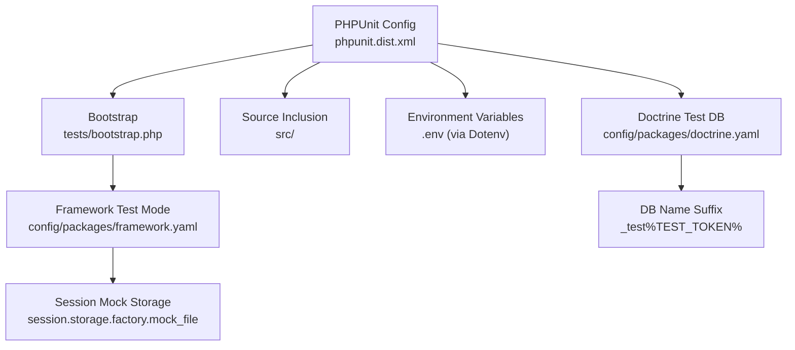
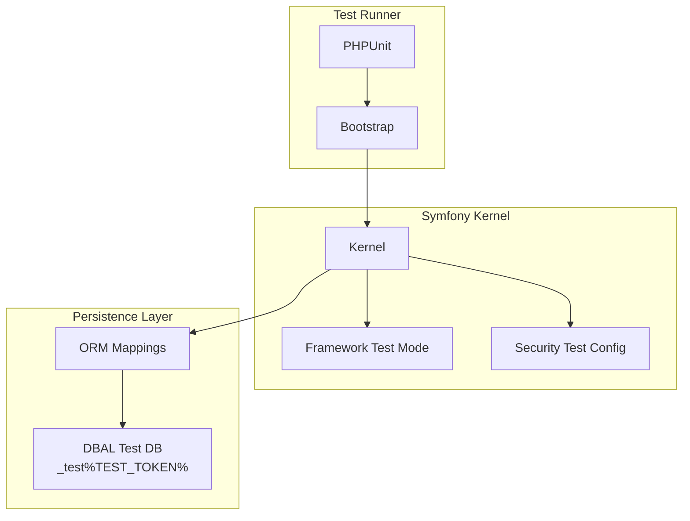
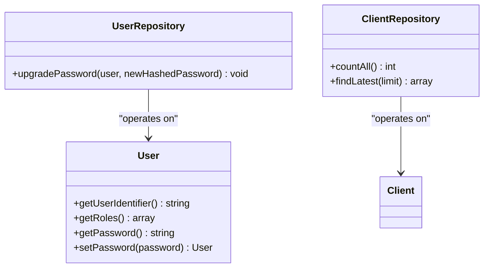
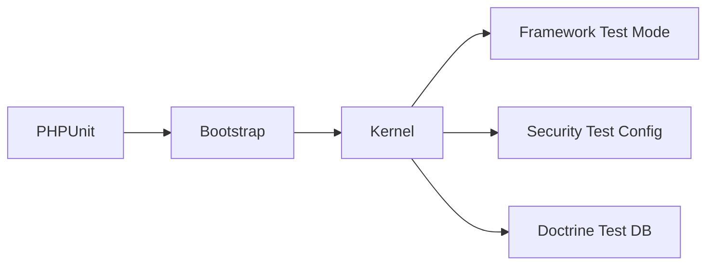

# Testing Strategy

<cite>
**Referenced Files in This Document**
- [phpunit.dist.xml](file://phpunit.dist.xml)
- [bootstrap.php](file://tests/bootstrap.php)
- [composer.json](file://composer.json)
- [doctrine.yaml](file://config/packages/doctrine.yaml)
- [framework.yaml](file://config/packages/framework.yaml)
- [security.yaml](file://config/packages/security.yaml)
- [LoginController.php](file://src/Controller/LoginController.php)
- [UserRepository.php](file://src/Repository/UserRepository.php)
- [User.php](file://src/Entity/User.php)
- [ClientRepository.php](file://src/Repository/ClientRepository.php)
</cite>

## Table of Contents
1. [Introduction](#introduction)
2. [Project Structure](#project-structure)
3. [Core Components](#core-components)
4. [Architecture Overview](#architecture-overview)
5. [Detailed Component Analysis](#detailed-component-analysis)
6. [Dependency Analysis](#dependency-analysis)
7. [Performance Considerations](#performance-considerations)
8. [Troubleshooting Guide](#troubleshooting-guide)
9. [Conclusion](#conclusion)
10. [Appendices](#appendices)

## Introduction
This document defines a comprehensive testing strategy for the Symfony application. It covers PHPUnit configuration, test bootstrap, and environment setup for the test environment. It also documents unit testing strategies for controllers, repositories, and services, along with integration testing approaches for database operations, form submissions, and security features. Guidance is included on organizing test cases, fixtures, and mock objects, as well as best practices, code coverage expectations, and continuous integration setup. Finally, it outlines performance, security, and acceptance testing approaches with concrete examples of controller tests, repository tests, and end-to-end scenarios.

## Project Structure
The testing setup centers around the PHPUnit configuration and a minimal bootstrap script. Composer autoload-dev maps the tests namespace, and Symfony’s configuration activates test-specific behavior for framework and Doctrine.

**Diagram sources**
- [phpunit.dist.xml:1-45](file://phpunit.dist.xml#L1-L45)
- [bootstrap.php:1-14](file://tests/bootstrap.php#L1-L14)
- [framework.yaml:11-16](file://config/packages/framework.yaml#L11-L16)
- [doctrine.yaml:30-34](file://config/packages/doctrine.yaml#L30-L34)

**Section sources**
- [phpunit.dist.xml:1-45](file://phpunit.dist.xml#L1-L45)
- [bootstrap.php:1-14](file://tests/bootstrap.php#L1-L14)
- [composer.json:73-77](file://composer.json#L73-L77)
- [framework.yaml:11-16](file://config/packages/framework.yaml#L11-L16)
- [doctrine.yaml:30-34](file://config/packages/doctrine.yaml#L30-L34)

## Core Components
- PHPUnit configuration
  - Bootstrap script path, environment variables, and source inclusion are defined.
  - Deprecation policies are enforced during tests.
- Test bootstrap
  - Loads Composer autoload and boots environment variables via Dotenv.
  - Honors APP_DEBUG to adjust umask.
- Framework test mode
  - Enables test flag and switches session storage to a mock file factory.
- Doctrine test database
  - Uses a database name suffix with TEST_TOKEN to isolate test runs.
- Security test configuration
  - Adjusts password hasher cost/time/memory for faster hashing in tests.

**Section sources**
- [phpunit.dist.xml:10-18](file://phpunit.dist.xml#L10-L18)
- [phpunit.dist.xml:26-40](file://phpunit.dist.xml#L26-L40)
- [bootstrap.php:3-13](file://tests/bootstrap.php#L3-L13)
- [framework.yaml:11-16](file://config/packages/framework.yaml#L11-L16)
- [doctrine.yaml:30-34](file://config/packages/doctrine.yaml#L30-L34)
- [security.yaml:48-55](file://config/packages/security.yaml#L48-L55)

## Architecture Overview
The testing architecture integrates PHPUnit, Symfony’s kernel, Doctrine ORM, and security components under a dedicated test environment.

**Diagram sources**
- [phpunit.dist.xml:10-18](file://phpunit.dist.xml#L10-L18)
- [bootstrap.php:3-13](file://tests/bootstrap.php#L3-L13)
- [framework.yaml:11-16](file://config/packages/framework.yaml#L11-L16)
- [security.yaml:48-55](file://config/packages/security.yaml#L48-L55)
- [doctrine.yaml:30-34](file://config/packages/doctrine.yaml#L30-L34)

## Detailed Component Analysis

### PHPUnit Configuration and Bootstrap
- Bootstrap
  - Ensures environment variables are loaded before Symfony initializes.
  - Aligns umask behavior with debug settings.
- PHPUnit
  - Sets APP_ENV=test and disables shell verbosity.
  - Includes src in coverage analysis and enforces deprecation policies.

Best practices:
- Keep bootstrap minimal and deterministic.
- Use TEST_TOKEN for database isolation across parallel tests.

**Section sources**
- [bootstrap.php:3-13](file://tests/bootstrap.php#L3-L13)
- [phpunit.dist.xml:10-18](file://phpunit.dist.xml#L10-L18)
- [phpunit.dist.xml:26-40](file://phpunit.dist.xml#L26-L40)

### Unit Testing Strategies

#### Controllers
- Example focus: LoginController
  - Renders login page with last username and authentication error.
  - Strategy: Assert response rendering, presence of template variables, and route annotation.

Recommended approach:
- Use BrowserKit or Panther for functional tests.
- For pure controller logic, assert rendered variables and status codes.

**Section sources**
- [LoginController.php:9-21](file://src/Controller/LoginController.php#L9-L21)

#### Repositories
- Example focus: UserRepository and ClientRepository
  - UserRepository implements PasswordUpgraderInterface and persists upgraded passwords.
  - ClientRepository provides countAll and findLatest using QueryBuilder.

Recommended approach:
- Unit-test repository methods by mocking EntityManager and QueryBuilder.
- Verify SQL-like behavior without hitting the database.

**Diagram sources**
- [UserRepository.php:15-34](file://src/Repository/UserRepository.php#L15-L34)
- [ClientRepository.php:12-35](file://src/Repository/ClientRepository.php#L12-L35)
- [User.php:14-100](file://src/Entity/User.php#L14-L100)

**Section sources**
- [UserRepository.php:15-34](file://src/Repository/UserRepository.php#L15-L34)
- [ClientRepository.php:12-35](file://src/Repository/ClientRepository.php#L12-L35)
- [User.php:14-100](file://src/Entity/User.php#L14-L100)

#### Services
- Strategy: Isolate service logic behind interfaces and inject dependencies.
- Use mocks for external collaborators (HTTP clients, mailers).
- Assert method calls and return values.

### Integration Testing Approaches

#### Database Operations
- Doctrine test database
  - dbname_suffix with TEST_TOKEN ensures per-process isolation.
- Best practices:
  - Use transactions or database refresh strategies.
  - Seed minimal fixtures for each test.

**Section sources**
- [doctrine.yaml:30-34](file://config/packages/doctrine.yaml#L30-L34)

#### Form Submissions
- Approach:
  - Use BrowserKit to submit forms and assert redirects or rendered templates.
  - Validate form constraints via forms’ types and constraints.
- Security note:
  - CSRF protection is configured; ensure tests handle tokens.

**Section sources**
- [csrf.yaml](file://config/packages/csrf.yaml)

#### Security Features
- Test authentication flows:
  - Successful login, invalid credentials, access control enforcement.
- Test configuration:
  - Lower cost/time/memory for password hashing in test environment.
- Logout and impersonation:
  - Validate redirect targets and session cleanup.

**Section sources**
- [security.yaml:48-55](file://config/packages/security.yaml#L48-L55)
- [framework.yaml:11-16](file://config/packages/framework.yaml#L11-L16)

### Test Case Organization, Fixtures, and Mock Objects
- Organization
  - Group tests by feature or layer (unit/integration).
  - Use descriptive test names and arrange assertions with BDD-style comments.
- Fixtures
  - Prefer lightweight factories or minimal seed data.
  - Use Doctrine fixtures for complex datasets; keep seeds deterministic.
- Mock Objects
  - Replace external services (mailer, HTTP client) with mocks.
  - Verify interactions and avoid real network calls.

### Continuous Integration Setup
- PHPUnit configuration supports caching and deprecation enforcement.
- Recommended CI steps:
  - Install dependencies.
  - Run PHPUnit with coverage collection.
  - Enforce minimum coverage thresholds.
  - Parallelize tests using TEST_TOKEN for DB isolation.

**Section sources**
- [phpunit.dist.xml:11, 42-44](file://phpunit.dist.xml#L11,L42-L44)
- [composer.json:50-58](file://composer.json#L50-L58)

## Dependency Analysis
The testing stack depends on Symfony’s framework and Doctrine configuration, with PHPUnit orchestrating the suite.

**Diagram sources**
- [phpunit.dist.xml:10-18](file://phpunit.dist.xml#L10-L18)
- [bootstrap.php:3-13](file://tests/bootstrap.php#L3-L13)
- [framework.yaml:11-16](file://config/packages/framework.yaml#L11-L16)
- [security.yaml:48-55](file://config/packages/security.yaml#L48-L55)
- [doctrine.yaml:30-34](file://config/packages/doctrine.yaml#L30-L34)

**Section sources**
- [phpunit.dist.xml:10-18](file://phpunit.dist.xml#L10-L18)
- [bootstrap.php:3-13](file://tests/bootstrap.php#L3-L13)
- [framework.yaml:11-16](file://config/packages/framework.yaml#L11-L16)
- [security.yaml:48-55](file://config/packages/security.yaml#L48-L55)
- [doctrine.yaml:30-34](file://config/packages/doctrine.yaml#L30-L34)

## Performance Considerations
- Use mock sessions and caches in test environment to reduce overhead.
- Keep test databases small and isolated; leverage TEST_TOKEN suffix.
- Minimize external service calls; stub or containerize dependencies.
- Parallelize tests safely with isolated DB names and mocked services.

[No sources needed since this section provides general guidance]

## Troubleshooting Guide
Common issues and resolutions:
- Environment not loading
  - Ensure Dotenv bootstrapping occurs before Symfony initialization.
- Session-related failures
  - Confirm framework test mode is active and session storage is mock-based.
- Database collisions
  - Verify TEST_TOKEN is set and dbname_suffix is applied.
- Security test slowdowns
  - Confirm lower-cost password hashing is active in test configuration.

**Section sources**
- [bootstrap.php:7-9](file://tests/bootstrap.php#L7-L9)
- [framework.yaml:14-16](file://config/packages/framework.yaml#L14-L16)
- [doctrine.yaml:33-34](file://config/packages/doctrine.yaml#L33-L34)
- [security.yaml:50-55](file://config/packages/security.yaml#L50-L55)

## Conclusion
This testing strategy leverages PHPUnit, Symfony’s test environment, and Doctrine’s test database isolation to deliver reliable unit and integration tests. By structuring tests around controllers, repositories, and services, and by incorporating security and form validation checks, teams can maintain high confidence in code quality. Adopting best practices for fixtures, mocks, and CI pipelines ensures sustainable and scalable test coverage.

[No sources needed since this section summarizes without analyzing specific files]

## Appendices

### Example Scenarios

#### Controller Test: LoginController
- Objective: Validate login page rendering and error handling.
- Steps:
  - Request GET /login.
  - Assert rendered template variables (last username, error).
  - Submit invalid credentials and assert error propagation.

**Section sources**
- [LoginController.php:9-21](file://src/Controller/LoginController.php#L9-L21)

#### Repository Test: ClientRepository
- Objective: Validate counting and latest records retrieval.
- Steps:
  - Seed minimal dataset.
  - Assert countAll equals dataset size.
  - Assert findLatest returns most recent items ordered by ID.

**Section sources**
- [ClientRepository.php:19-34](file://src/Repository/ClientRepository.php#L19-L34)

#### End-to-End Test: Authentication Flow
- Objective: Validate login/logout and access control.
- Steps:
  - Navigate to login.
  - Submit credentials (valid/invalid).
  - Assert redirect and user session.
  - Access protected route and assert role-based access.
  - Logout and assert redirect to login.

**Section sources**
- [security.yaml:20-45](file://config/packages/security.yaml#L20-L45)
- [framework.yaml:11-16](file://config/packages/framework.yaml#L11-L16)

### Security Testing Checklist
- Password hashing cost/time/memory tuned for tests.
- CSRF token handling in forms.
- Access control rules validated for roles.
- Logout behavior and session cleanup verified.

**Section sources**
- [security.yaml:48-55](file://config/packages/security.yaml#L48-L55)
- [csrf.yaml](file://config/packages/csrf.yaml)

### Performance Testing Checklist
- Mock external services and caches.
- Use transactional fixtures or database refresh strategies.
- Parallelize tests with isolated DB names.

**Section sources**
- [doctrine.yaml:30-34](file://config/packages/doctrine.yaml#L30-L34)